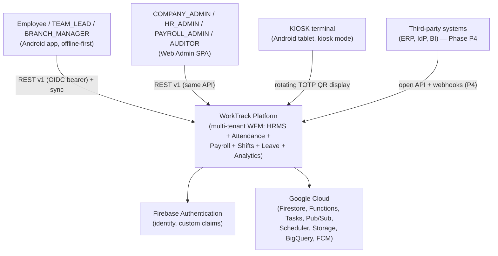
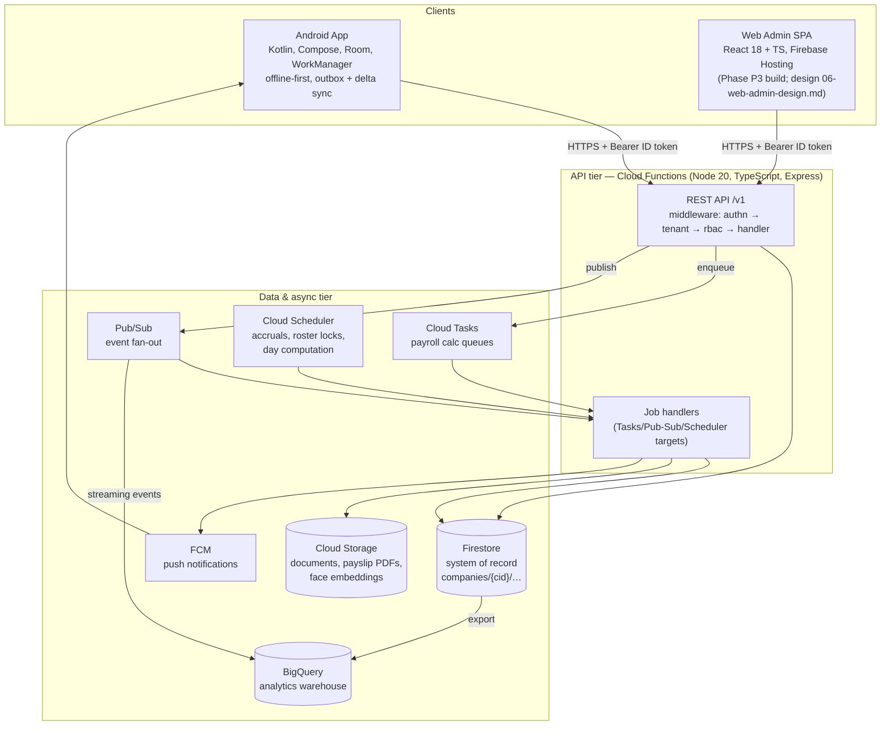
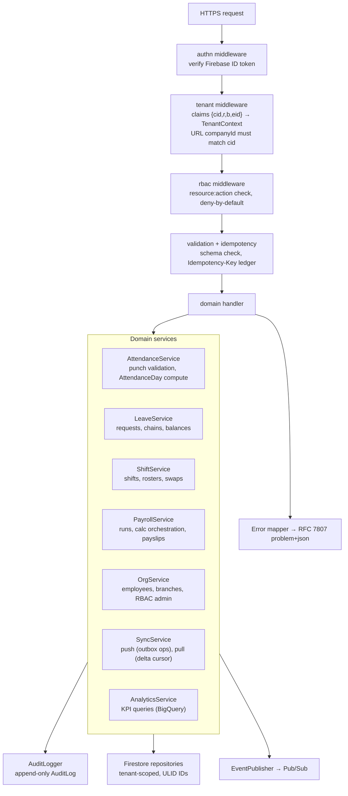
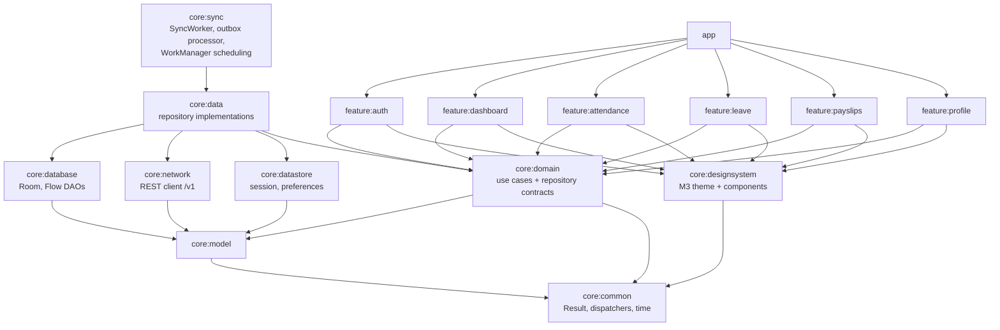
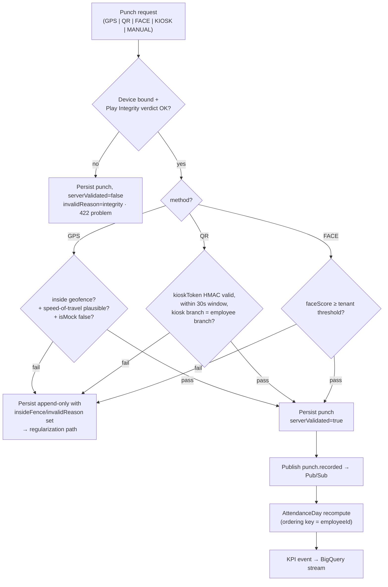
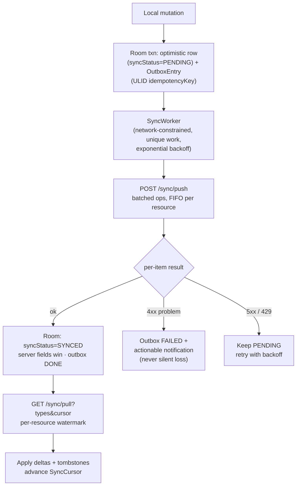

# WorkTrack — System Architecture

Version: 1.0 · Status: Approved · Owners: Platform Architecture · Derives from: `00-master-spec.md`

**Purpose.** This document specifies the system architecture of the WorkTrack platform: C4-style context/container/component views, the responsibilities and contracts of each container, the multi-tenancy and request-lifecycle design, idempotency/pagination/error models, scalability analysis to 100,000 employees per tenant, failure modes and resilience mechanisms, and the Architecture Decision Records that fix the major technology choices. It is the engineering counterpart to `01-product-requirements.md`; security controls are detailed further in `07-security-architecture.md`.

---

## 1. Context view (C4 level 1)



System boundaries: WorkTrack owns everything inside the platform box; Firebase Auth is the identity provider; all compute/storage is GCP-managed. There is no privileged back channel — Android, Web Admin, and third parties consume the same `/v1` REST API (master spec §5).

## 2. Container view (C4 level 2)



### 2.1 Container responsibilities

| Container | Responsibilities | Key constraints |
|---|---|---|
| **Android app** | Offline-first client for EMPLOYEE/TEAM_LEAD/BRANCH_MANAGER personas and kiosk mode. Room is the local source of truth; UI reads only from Room (Flow-based DAOs → repositories → use cases → Compose state). Mutations write Room optimistically and enqueue OutboxEntry rows; `SyncWorker` (WorkManager) drains the outbox FIFO-per-resource and delta-pulls per SyncCursor. Module graph per master spec §6.1 (`app`, `feature:*`, `core:*`). | No direct Firestore SDK access to server-authoritative collections; all mutations via REST. Punches append-only client-side. Tokens in EncryptedSharedPreferences/Keystore. |
| **Web Admin SPA** | React 18 + TypeScript admin console (COMPANY_ADMIN, HR_ADMIN, PAYROLL_ADMIN, BRANCH_MANAGER, AUDITOR). Online-first; consumes the identical `/v1` API; served from Firebase Hosting. | No offline mutation queue; RBAC mirrored client-side for UX only. Implementation is roadmap Phase P3 (design in `06-web-admin-design.md`, referenced by master spec §2 as Phase 4 of the doc set's numbering — canonical delivery phase is P3 per §8). |
| **REST API (Cloud Functions + Express)** | Single versioned HTTP surface `/v1`. Middleware chain (authn → tenant → rbac), request validation, domain services (attendance validation, leave decisioning, sync push/pull), idempotency ledger, audit logging, RFC 7807 errors. | Stateless; min-instances configured on hot functions to bound cold starts on the punch path. Deny-by-default RBAC. |
| **Job handlers** | Same codebase, separate function targets invoked by Cloud Tasks (payroll calculation), Pub/Sub (fan-out consumers: notifications, projections, BigQuery events), Cloud Scheduler (leave accruals, roster generation/locks, AttendanceDay end-of-day sweep). | Every handler idempotent; every queue has a DLQ; job progress persisted in Firestore run documents. |
| **Firestore** | System of record. `companies/{cid}` document + sub-collections per master spec §4.6. Composite indexes on `(employeeId, date)`, `(status, updatedAt)`, `(updatedAt)`. | Security rules deny direct client access to server-authoritative collections (defense in depth behind the API). 1 write/s/document sustained limit drives the sharding design (§6.1). |
| **Cloud Tasks** | Per-tenant payroll calculation queues; controlled concurrency and rate; task = one employee batch. | Named tasks for deduplication; retry with backoff; DLQ-equivalent via max-attempt capture to Firestore. |
| **Pub/Sub** | Event fan-out: `punch.recorded`, `leave.decided`, `payslip.published`, `roster.changed` → notification fan-out, projection recompute, BigQuery streaming, (P4) webhook dispatch. | At-least-once delivery; consumers idempotent; ordering keys per employee where sequence matters. |
| **Cloud Scheduler** | Cron entry points: monthly/yearly accruals, roster lock at T-N days, rotation generation, nightly AttendanceDay sweep per timezone cohort, retention/purge jobs. | Fires a Pub/Sub message or Tasks enqueue; never does the work inline. |
| **Cloud Storage** | Employee documents, payslip PDFs, face embeddings (CMEK option). Access via short-lived signed URLs issued by the API. | No public buckets; per-tenant path prefix `tenants/{cid}/…`; raw face captures deleted post-embedding. |
| **BigQuery** | Analytics warehouse fed by Firestore export + Pub/Sub streaming. Serves `/analytics/kpis`, dashboards, and Phase P4 AI feature pipelines. | Datasets partitioned by date, clustered by `companyId`; analytics never scan Firestore. |
| **FCM** | Push delivery for NotificationMessage fan-out; token lifecycle tracked on Device rows (`fcmToken`). | Push is a hint, not a transport: clients reconcile via `/sync/pull`, so a lost push never loses data. |

## 3. Component view — API tier (C4 level 3)



### 3.1 Component view — Android container

The Android component structure is the master spec module graph (§6.1) rendered as dependencies:



Responsibilities: `core:database` holds the Room schema mirroring the canonical model (§4 of the master spec) plus client-only OutboxEntry and SyncCursor tables; `core:network` is the typed `/v1` client (auth interceptor, problem+json decoding, idempotency header injection); `core:sync` owns the outbox drain (FIFO per resource) and delta pull; `core:domain` exposes use cases so `feature:*` modules never see data-layer types. Build wiring comes from the `build-logic/` convention plugins named in master spec §6.1.

### 3.2 Key flows

**Punch validation (server-side), `POST /attendance/punches`:**



**Sync cycle (client outbox + delta pull):**



---

## 4. Multi-tenancy design

1. **Storage isolation** — every aggregate lives under `companies/{companyId}/…` sub-collections (master spec §4.6). There are no cross-tenant collections except platform-internal operator data. Collection-group queries are used only by `SUPER_ADMIN` tooling and are permission-fenced.
2. **Identity binding** — Firebase Auth custom claims carry `{ cid: companyId, r: [roleCodes], b: [branchIds], eid: employeeId }`. Claims are set server-side at employee provisioning/role change; a claim change forces token refresh (≤ 60 min natural expiry; deactivation additionally revokes refresh tokens).
3. **Request binding** — every route resolves the tenant from the **verified ID token, never from the URL alone**; if a URL carries `companyId` it must equal `cid` or the request fails with `403` (`tenant-mismatch` problem type). Repositories accept a `TenantContext` and prefix every Firestore path with it — a handler cannot physically address another tenant's collection.
4. **Scope enforcement** — RBAC scoping (COMPANY/BRANCH/DEPARTMENT via RoleAssignment) is applied as query constraints (e.g. a `BRANCH_MANAGER` roster query is forced to `branchId ∈ claims.b`), not post-filtering.
5. **Blast-radius controls** — per-tenant Cloud Tasks queues and per-tenant rate limits prevent one tenant's payroll run or sync storm from starving others; per-tenant BigQuery partitioning bounds analytics cost attribution (§6.4).

## 5. Cross-cutting API design

### 5.1 Request lifecycle

Middleware order is fixed: `authn → tenant → rbac → validation/idempotency → handler → audit/event → response`. Failures short-circuit with RFC 7807 bodies. Every request carries a generated `requestId` (returned as `X-Request-Id`, logged, and attached to problem responses as `instance`).

### 5.2 Idempotency design

- `Idempotency-Key` header honored on **all POSTs** (master spec §5). Clients use ULIDs; the Android outbox uses the OutboxEntry `idempotencyKey`.
- Ledger: `companies/{cid}/idempotency/{key}` document storing `{requestHash, status, responseSnapshot, createdAt, expiresAt}`. TTL 24 h (sync/punch) to 30 days (payroll run creation).
- Semantics: first request executes inside a transaction that also creates the ledger entry; replay with same key + same `requestHash` returns the stored response with `Idempotency-Replayed: true`; same key + different hash → `409 idempotency-key-reuse`; concurrent duplicate (`status=IN_PROGRESS`) → `409` with `Retry-After`.
- Append-only punches get a second guard: the punch ID itself is the client ULID, so even a ledger miss cannot double-insert.

### 5.3 Pagination / cursor design

- All list endpoints: `?cursor&limit` (default 25, max 100 for interactive; `/sync/pull` max 500). Envelope: `{ "data": [...], "meta": { "cursor": "..." } }`; absent `meta.cursor` = last page.
- Cursor = opaque base64url token encoding `{orderField(s), lastValues, direction, filterHash}` + HMAC. Tampering or reuse across a changed filter set → `400 invalid-cursor`.
- Ordering is always over an indexed, unique-suffixed key (e.g. `(date, id)` or `(updatedAt, id)` using ULID tiebreaker) so pagination is stable under concurrent writes.
- `/sync/pull` cursors are per resource type (client SyncCursor rows) and are watermark cursors over `(updatedAt, id)`; deletes are delivered as tombstones (`deletedAt` set) so clients can converge.

### 5.4 Error model (RFC 7807)

`Content-Type: application/problem+json`. Problem `type` URIs are stable API contract: `https://api.worktrack.app/problems/<slug>`.

```json
{
  "type": "https://api.worktrack.app/problems/outside-geofence",
  "title": "Punch outside geofence",
  "status": 422,
  "detail": "Location is 412 m from branch fence 'HQ-North' (radius 150 m).",
  "instance": "/v1/attendance/punches/01J8ZQ…",
  "requestId": "req_01J8ZQ…",
  "errors": [{ "field": "lat", "reason": "outside_fence" }]
}
```

Canonical problem catalog (excerpt): `validation-failed` (400), `invalid-cursor` (400), `unauthenticated` (401), `permission-denied` / `tenant-mismatch` (403), `not-found` (404), `conflict` / `idempotency-key-reuse` / `version-conflict` (409), `outside-geofence` / `integrity-verdict-failed` / `insufficient-balance` / `kiosk-token-invalid` (422), `rate-limited` (429, with `Retry-After`), `internal` (500), `dependency-unavailable` (503). The Android sync layer maps 4xx problems to actionable user notifications and 5xx/429 to retry-with-backoff.

---

## 6. Scalability analysis

### 6.1 Firestore write sharding for hot aggregates

Hot spots and their treatment:

| Hot aggregate | Load pattern | Design |
|---|---|---|
| `punches` | Burst at shift boundaries (thousands of writes/min/tenant) | Naturally sharded: one document per punch, ULID doc IDs (near-monotonic but written across many employees → no single hot document; collection index fan-in is the limit, monitored). |
| `attendanceDays` | One doc per employee/date, recomputed on punch/regularization | Document key `{employeeId}_{date}` — writes distribute across employees; per-document rate is ≤ a few writes/day. Recompute is event-driven (Pub/Sub, ordering key = employeeId) + nightly sweep; `version` field makes recompute last-writer-safe. |
| Company-level counters (present count, live KPI tiles) | Every punch would touch one doc → exceeds 1 write/s/doc | **Sharded counters**: `attendanceDayAgg/{date}/shards/{0..N}` (N sized by branch headcount, default 20); readers sum shards; N is resizable online. At ≥ 5k employees/branch these counters are dropped entirely in favor of BigQuery-served KPIs. |
| `payrollRuns` progress | 100k task completions updating one run doc | Tasks update per-batch progress docs `payrollRuns/{id}/batches/{n}`; a Pub/Sub-driven aggregator folds batch states into the run doc at ≤ 1 write/s. |
| Idempotency ledger | Bursty on sync push | Keyed by client ULID → uniformly distributed; TTL-expired via scheduled purge. |

### 6.2 Fan-out strategies

- **Notification fan-out** (announcement to 100k employees): the API writes the Announcement once and publishes to Pub/Sub; a consumer expands the audience in pages of 500, writing NotificationMessage docs via BulkWriter and batching FCM sends (500/multicast). No request-path fan-out.
- **Projection fan-out** (punch → AttendanceDay → KPI event): chained through Pub/Sub with per-employee ordering keys; each stage idempotent (recompute-from-source, not increment).
- **Roster fan-out**: rotation generation emits per-branch jobs; each job writes ShiftAssignments in 500-doc batches.

### 6.3 Scaling to 100k employees per tenant (explicit design)

| Concern | Naive approach (rejected) | 100k design |
|---|---|---|
| Roster generation (100k × 28 days ≈ 2.8M ShiftAssignments) | Single function invocation loops all employees — exceeds function timeout, memory | Cloud Scheduler → orchestrator enqueues **batched Cloud Tasks jobs** (1 task = 1 branch or 1k-employee slice); each task writes ≤ 500-doc batches with progress checkpoints; resumable at slice granularity; target ≤ 15 min end-to-end |
| Payroll run (100k payslips) | Synchronous calculation in the API request | `POST /payroll/runs` returns `202`-style DRAFT→CALCULATING immediately; orchestrator shards employees into **Cloud Tasks queue** batches (250/task, per-tenant queue with capped dispatch rate); per-batch results in sub-docs; failed employees quarantined to an exceptions list without failing the run; target ≤ 30 min |
| Analytics/KPIs | Firestore collection scans + in-memory aggregation | **BigQuery instead of Firestore aggregation**: Firestore export + Pub/Sub streaming keep BQ ≤ 24 h fresh (streamed events near-real-time); `/analytics/kpis` queries partitioned/clustered BQ tables; Firestore serves only small precomputed counter tiles at low headcounts |
| Attendance day sweep | One nightly job for all tenants | Timezone-cohort scheduling: Scheduler fires per timezone offset; per-tenant per-branch tasks; only employees with activity or expected shifts are touched (query on `(status, updatedAt)` index) |
| Sync pull after long offline | Unbounded delta | Watermark cursor + 500-doc pages + per-type prioritization (punches/assignments first); server caps a single pull session and the client resumes — no timeout cliffs |
| Directory search | Firestore prefix queries at 100k | Search index in BigQuery (P3) or dedicated index; Firestore remains source of record |

### 6.4 Per-tenant isolation & cost controls

- Per-tenant Cloud Tasks queues (payroll) and per-tenant rate limits (API) bound noisy-neighbor impact.
- Cost attribution: Pub/Sub event stream aggregates per-tenant document read/write counts into a daily BigQuery cost table (NFR-CST-001); plan enforcement (Company `plan`) throttles or gates expensive features (analytics ranges, export frequency).
- Firestore read amplification is bounded by design: clients read projections (AttendanceDay) not raw punches; list endpoints cap ranges (≤ 92 days); dashboards read BigQuery.

## 7. Failure modes & resilience

| Failure | Detection | Response | Degradation |
|---|---|---|---|
| API unavailable / network loss (client) | OkHttp failures, sync errors | Outbox retains ops; WorkManager retries with exponential backoff + jitter (network-constrained, unique work) | Full offline operation from Room ≥ 72 h; UI shows sync state, never blocks punch capture |
| Firestore unavailable | Health checks, error rates | Functions return `503 dependency-unavailable` with `Retry-After`; clients back off | Reads may be served stale from client cache; no writes accepted (no write-behind on server) |
| Cloud Tasks handler crash | Task retry with backoff (max 10 attempts) | Idempotent handlers re-run safely; after max attempts, task payload captured to `deadLetters` collection + alert | Payroll batch marked failed-quarantined; run continues; operator re-drives from DLQ |
| Pub/Sub consumer failure | Redelivery, DLQ topic after 5 attempts | DLQ subscription + replayer tool; consumers idempotent so replay is safe | Projections lag; source of record unaffected; KPI staleness visible via `computedAt` |
| Duplicate delivery (Tasks/PubSub at-least-once) | — | Idempotency by natural keys (`{employeeId}_{date}`, punch ULIDs, run+batch IDs) | None — by construction |
| Kiosk offline | Kiosk detects staleness | TOTP QRs are generated locally from a provisioned secret — kiosk keeps issuing valid codes offline; employee app queues the punch | Server validates on sync within skew window; branch mismatch still enforced server-side |
| FCM push loss | — | Push is advisory; `/sync/pull` on app foreground reconciles | Delayed notification, no data loss |
| Clock skew (client) | Server compares `punchedAt` vs receipt time | Outside skew bound → punch stored with `invalidReason=clock-skew`, flagged for regularization | Employee informed; no silent rejection |
| Sync conflict (server rejects op) | 4xx problem on `/sync/push` item | Per-item results in batch response; client marks OutboxEntry FAILED and raises an actionable notification (master spec §6.3.6) | Never silent data loss; user can amend and resubmit |
| Regional outage | Cloud Monitoring | Multi-region Firestore (nam5/eur3-class) rides zone loss; regional function outage → status page, error budget consumed | Offline-first clients absorb API downtime for field workflows |

Retry policy summary: client outbox — exponential backoff with jitter, base 30 s, cap 1 h, retained until explicit failure classification (4xx = terminal → user action; 5xx/429 = retry). Server-to-server — Tasks/PubSub native retries, handlers idempotent, DLQ after bounded attempts, replay tooling + alerting on DLQ depth > 0.

## 8. Operational architecture

### 8.1 Environments & deployment

| Environment | Purpose | Data | Notes |
|---|---|---|---|
| `dev` | Per-engineer iteration | Synthetic seed tenants | Firebase Emulator Suite (Auth, Firestore, Functions) for local work; shared dev project for integration |
| `staging` | Pre-release validation | Synthetic incl. the 100k-employee load tenant | Mirrors prod config incl. Firestore indexes, Scheduler jobs, queues; release-gate suites run here |
| `prod` | Customer traffic | Tenant data, region-pinned | Progressive rollout; Android via Play staged rollout, functions via traffic-safe deploy |

CI/CD: trunk-based; every merge runs unit + rules-emulator + API contract tests; staging deploy on merge; prod deploy is a tagged release with automated canary checks against SLO burn (rollback = redeploy previous tag; Firestore schema changes are additive-only, so rollback never needs data migration). Android release train is fortnightly; server API remains backward-compatible with the two previous app versions (additive `/v1` evolution per master spec §3.4).

### 8.2 Observability

- **Correlation** — `X-Request-Id` generated at ingress, propagated into logs, Pub/Sub message attributes, Cloud Tasks payloads, and RFC 7807 `requestId`; a payroll run's `runId` links every batch log.
- **Metrics** — RED per endpoint (rate, errors, duration histograms) tagged by tenant plan tier (not tenant ID, to bound cardinality); queue depth, DLQ depth, job durations, sync push batch outcomes, punch validation outcomes by `invalidReason`.
- **SLO monitoring** — burn-rate alerts on NFR-AVL/NFR-LAT budgets (`01-product-requirements.md` §6); paging on fast burn, ticketing on slow burn.
- **Logs** — structured JSON, PII-free by lint-enforced logging helpers; audit-relevant events go to AuditLog (the product feature), operational logs to Cloud Logging (30-day retention).
- **Client telemetry** — crash reporting plus sync-health beacons (outbox depth, oldest PENDING age); a fleet-wide rise in oldest-PENDING age is the leading indicator of a sync regression.

### 8.3 Data lifecycle & retention

| Data class | Store | Retention | Disposal |
|---|---|---|---|
| AttendancePunch, AttendanceDay | Firestore (+ BigQuery) | 7 years (payroll-affecting) | Archive to Storage export, then purge job |
| AuditLog | Firestore (+ BigQuery) | ≥ 7 years, immutable | Legal-hold aware purge |
| Payslip, PayrollRun | Firestore + PDF in Storage | ≥ 7 years | Never purged while tenant active without legal review |
| Face embeddings | Cloud Storage (CMEK option) | Employment + 30 days | Hard delete on exit/opt-out; raw captures deleted post-embedding (never retained) |
| EmployeeDocument | Cloud Storage | Per-kind policy, tenant-configurable | Signed-URL access only; delete on DSR where lawful |
| NotificationMessage | Firestore | 180 days | TTL purge |
| Idempotency ledger | Firestore | 24 h – 30 days by endpoint class | TTL purge |
| Operational logs | Cloud Logging | 30 days | Automatic |
| DSR erasure | cross-cutting | — | PII pseudonymized in place; financial/statutory records retain integrity (FR-PLT-007) |

---

## 9. Appendix — Architecture Decision Records

### ADR-001 — Firestore vs Cloud SQL as system of record
- **Context.** The system of record must serve thousands of tenants, offline-syncing mobile clients, per-tenant isolation, and spiky write bursts at shift boundaries, with a small platform team and no DBA capacity.
- **Decision.** Firestore, laid out as `companies/{cid}` sub-collections; relational integrity enforced in the service layer; analytics offloaded to BigQuery.
- **Consequences.** (+) Zero-ops horizontal scale, per-document ACLs as defense-in-depth, natural fit for delta sync (`updatedAt` watermarks), multi-region durability. (−) No joins/aggregates — requires projections (AttendanceDay), sharded counters, and BigQuery for analytics; 1 write/s/doc constraint shapes design (§6.1); cross-entity invariants (leave balances) need transactions and `version` fields. Revisit if a workload emerges that requires multi-entity transactions beyond Firestore's limits.

### ADR-002 — ULID identifiers
- **Context.** Offline clients must create entities (punches, leave requests) without a server round-trip; IDs must be globally unique, sortable for cursors, and index-friendly.
- **Decision.** ULIDs everywhere (client- and server-generated), doubling as idempotency keys for created resources.
- **Consequences.** (+) Offline generation, lexicographic time-ordering enables `(field, id)` cursor tiebreaks, no coordination. (−) IDs embed creation time (minor information leak — acceptable, IDs are never exposed unauthenticated); near-monotonic doc IDs could hot-spot a single-collection index at extreme write rates — mitigated because writes spread across per-tenant collections and many employees.

### ADR-003 — Server-authoritative writes for money/compliance paths
- **Context.** Attendance validity, leave balances, and payroll affect pay and legal compliance; offline clients can hold stale state or be tampered with.
- **Decision.** Clients propose, the server decides (master spec §3.1): punch validity, AttendanceDay computation, balance movements, and payroll math execute exclusively server-side; Firestore rules deny direct client writes to these collections.
- **Consequences.** (+) Single point of truth and audit; tamper resistance; recompute is always possible from append-only sources. (−) Offline UX shows provisional state (`syncStatus=PENDING`) that may later be rejected — mitigated by actionable rejection notifications and the regularization path; server must be sized for all computation.

### ADR-004 — Client outbox pattern with idempotency keys
- **Context.** Offline-first mutations need exactly-once effect over an at-least-once network, ordered per resource, surviving process death.
- **Decision.** Every local mutation enqueues a durable OutboxEntry (ULID `idempotencyKey`, FIFO per resource) in Room; `SyncWorker` drains via `POST /sync/push` batches; the server's idempotency ledger (§5.2) deduplicates.
- **Consequences.** (+) Exactly-once effect, crash-safe, testable queue semantics, uniform mutation path. (−) Two write paths on client (optimistic row + outbox) must stay consistent — enforced by writing both in one Room transaction; queue-head failures block a resource's queue — mitigated by terminal/retryable error classification (§7).

### ADR-005 — REST over gRPC
- **Context.** Two first-party clients (Android, browser SPA) plus future third-party integrators; Cloud Functions HTTP triggers; team debugging ergonomics.
- **Decision.** Versioned JSON REST (`/v1`) with RFC 7807 errors, cursor pagination, and idempotency headers; no gRPC surface.
- **Consequences.** (+) Browser-native, curl-debuggable, gateway/CDN-friendly, trivially consumable by partners (OpenAPI in P4); Cloud Functions HTTP fit. (−) No streaming (acceptable: sync is pull-based; push hints via FCM), no generated strong contracts — mitigated with OpenAPI-driven codegen for the Retrofit and web clients; JSON overhead acceptable at our payload sizes.

### ADR-006 — Cloud Functions vs Cloud Run for the API tier
- **Context.** Choice of serverless compute for Express: Functions (per-function deploy, scale-to-zero) vs Cloud Run (container, concurrency > 1, fewer cold-start pathologies).
- **Decision.** Cloud Functions (Node 20) for P0–P2, with the Express app structured as a standard container-ready codebase; min-instances on the punch/sync functions to bound cold starts.
- **Consequences.** (+) Lowest ops burden, native Firebase integration (auth context, deploy tooling), per-function scaling and IAM. (−) Cold starts and per-instance concurrency=1 cost more at high QPS; migration path to Cloud Run is explicitly preserved (no Functions-only APIs in handler code; Express app is host-agnostic). Trigger to migrate: sustained QPS where Run's concurrency materially cuts cost, or p95 latency breaches from cold starts.

### ADR-007 — Append-only events for punches and audit logs
- **Context.** Attendance punches and audit trails are legally sensitive; offline sync of mutable records requires conflict resolution.
- **Decision.** AttendancePunch and AuditLog are append-only and immutable (master spec §4.2, §4.5); corrections are new facts (RegularizationRequest) not edits; derived state (AttendanceDay) is recomputed, never hand-edited.
- **Consequences.** (+) No sync conflicts by construction, tamper-evidence, deterministic recomputation, simple client contract (no update/delete ops). (−) Storage grows monotonically — bounded by retention/archival policies (BigQuery + Storage export before purge); "wrong" punches remain visible — presented with `invalidReason` and superseding regularizations.

### ADR-008 — BigQuery for analytics instead of Firestore aggregation
- **Context.** KPIs, trends, and AI features over 100k-employee tenants; Firestore cannot aggregate and per-read costs make scans prohibitive.
- **Decision.** Firestore → BigQuery export plus Pub/Sub streaming events populate a tenant-partitioned warehouse; `/analytics/kpis` and `/analytics/insights` read BigQuery only; Firestore keeps at most small precomputed counter tiles for low-headcount real-time widgets.
- **Consequences.** (+) SQL analytics at scale, ML feature pipelines (Phase P4) get a native home, cost per query is bounded by partitioning/clustering. (−) Freshness ≤ 24 h for export-fed tables (streamed events narrow this); a second data platform to operate — accepted as the price of correct tool separation: Firestore for transactions, BigQuery for analysis.
