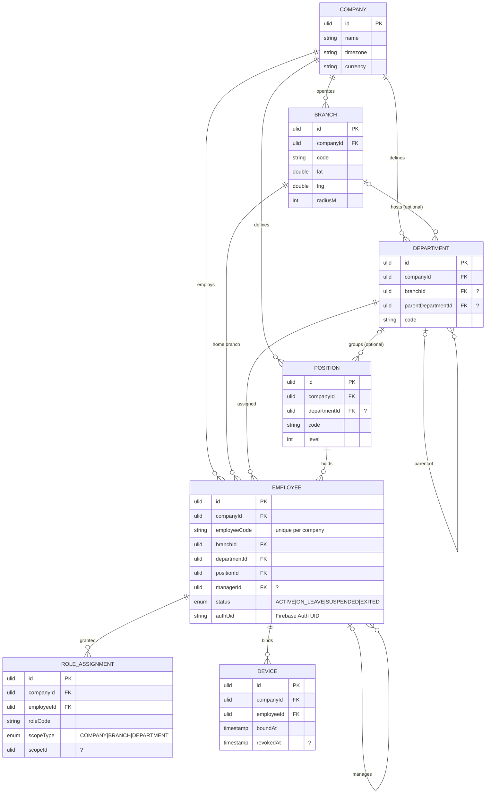
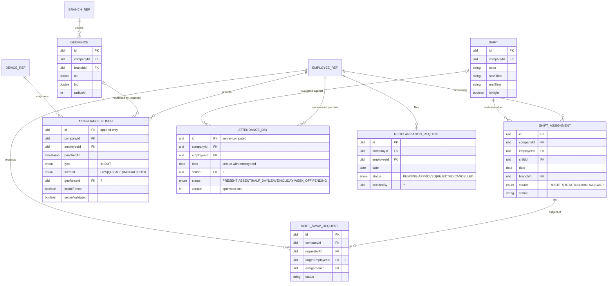
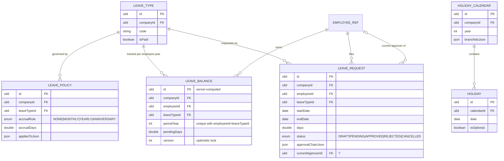
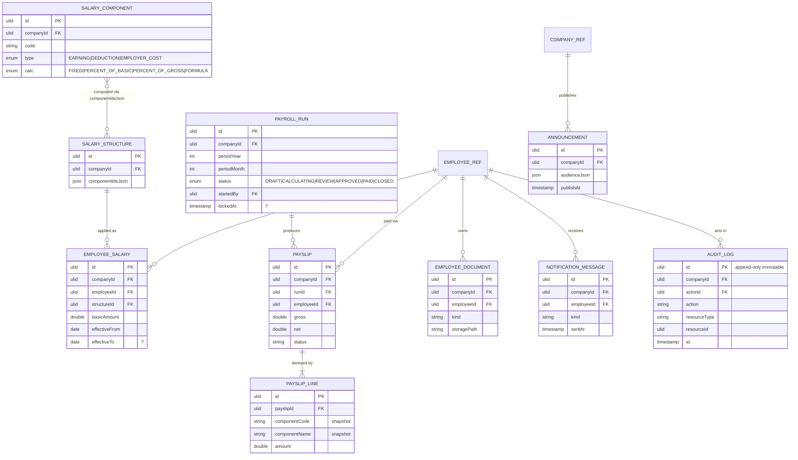

# WorkTrack — Database Design

Version: 1.0 · Status: Approved · Owners: Platform Architecture · Derives from: `00-master-spec.md` (§4, §6.3)

**Purpose.** This document specifies the persistence layer of WorkTrack end-to-end: the normalized logical model (3NF), its projection onto the two physical stores — Firestore (server system of record) and Room (Android offline store) — the full data dictionary for every entity in master spec §4, the Firestore collection/index/sharding plan for 100k-employee tenants, the on-device schema and retention windows, and the data lifecycle including BigQuery archival, soft-delete semantics, and GDPR erasure via crypto-shredding. It is the binding contract for `core:database` (Room), the Cloud Functions data access layer, and the Firestore security-rules model.

---

## 1. Modeling approach

### 1.1 Logical model: 3NF

The canonical model in master spec §4 is maintained in third normal form:

- **1NF** — all attributes atomic; repeating groups are extracted (e.g. `PayslipLine` rows instead of an amounts array; `Holiday` rows instead of a date list on `HolidayCalendar`).
- **2NF** — no partial dependencies on composite keys; every entity has a single surrogate ULID primary key, and natural keys (`Employee.employeeCode`, `Shift.code`, `LeaveType.code`) are enforced as unique constraints, not identifiers.
- **3NF** — no transitive dependencies: employee org placement lives only on `Employee` (`branchId`, `departmentId`, `positionId`); pay composition lives only on `SalaryComponent`/`SalaryStructure`; shift timing lives only on `Shift`.

Two classes of entity deliberately relax pure normalization, exactly as §4 declares:

| Class | Entities | Rationale |
|---|---|---|
| Append-only event logs | `AttendancePunch`, `AuditLog` | Immutable facts; no updates ⇒ no update anomalies, no sync conflicts |
| Server-computed projections | `AttendanceDay`, `LeaveBalance`, `PayrollRun.totalsJson` | Derived aggregates materialized for read performance; recomputable from events; guarded by `version` for optimistic concurrency |

### 1.2 Mapping to the two physical stores

| Concern | Firestore (server) | Room (Android) |
|---|---|---|
| Unit | Document in a per-tenant sub-collection (`companies/{cid}/…`, §4.6) | Row in a SQLite table, one table per entity |
| Primary key | Document ID = entity `id` (ULID, §3 below) | `id TEXT PRIMARY KEY` (same ULID) |
| Foreign keys | By-ID reference fields; integrity enforced in the API layer (Firestore has no FK constraints) | Declared `FOREIGN KEY` with `ON DELETE NO ACTION`; indices on every FK column |
| Enums | Uppercase string codes as written in §4 | `TEXT` + `@TypeConverter` to Kotlin enums |
| `*Json` fields | Nested map on the document | `TEXT` column holding canonical JSON (kotlinx.serialization) |
| Timestamps | Firestore `Timestamp` | `INTEGER` epoch millis UTC |
| Dates | `"yyyy-MM-dd"` string (timezone-independent business date) | `TEXT` ISO date |
| Tenancy | Structural (sub-collection path) + `companyId` field duplicated on the doc for collection-group queries and BigQuery export | `companyId` column; single-tenant device, kept for integrity checks |
| Concurrency | `updateTime` preconditions + `version` field on projections | `syncStatus` column; server fields win on reconcile (§6.3 of master spec) |

The same ULID is the identifier in both stores and in the REST API — there is no ID translation layer. Clients generate ULIDs offline; the server accepts them for client-originated aggregates (punches, leave requests, regularizations, swap requests) and generates them for server-originated ones (attendance days, payslips, payroll runs).

---

## 2. ER diagrams

Entities shown with key/discriminator fields; the full field list is in the data dictionary (§4 of this document). Entities suffixed `_REF` are cross-domain references owned by the Org & Identity diagram. `?` in a comment means nullable.

### 2.1 Org & Identity



### 2.2 Attendance & Scheduling



### 2.3 Leave



### 2.4 Payroll & Platform



---

## 3. Identifier strategy

- **ULIDs everywhere** (26-char Crockford base32). Sortable by creation time, generatable offline on Android with zero coordination, collision-safe (80 bits of randomness). The ULID is simultaneously the Room PK, the Firestore document ID, and the REST resource ID.
- Client-originated entities (punches, leave requests, regularizations, swap requests, devices, outbox ops) mint their ULID on-device; the server persists it verbatim, which makes retries naturally idempotent.
- Natural business keys (`employeeCode`, `Shift.code`, `LeaveType.code`, `SalaryComponent.code`, `Branch.code`) are unique **within a company** and enforced by API-layer transactional lookups (Firestore has no unique constraints); Room mirrors them with `UNIQUE` indices.
- Hot append-only collections use a **shard-prefixed document ID** (see §5.3) to defeat index hotspotting caused by ULID monotonicity; the `id` field inside the document remains the pure ULID.

---

## 4. Data dictionary

Types: `ULID`, `STRING`, `TEXT` (long-form), `TS` (timestamp: Firestore `Timestamp` / Room epoch-millis), `DATE` (ISO `yyyy-MM-dd`), `TIME` (`HH:mm`), `INT`, `DOUBLE`, `BOOL`, `ENUM`, `JSON`.

**Common columns (present on every entity, listed once).** Every entity carries `id ULID PK` plus the audit block `createdAt TS NOT NULL`, `updatedAt TS NOT NULL`, `deletedAt TS NULL` (soft delete, §7.3). Every entity except `Company`, `Holiday` (keyed by `calendarId`), `PayslipLine` (keyed by `payslipId`), and the two client-only tables carries `companyId ULID NOT NULL`. Room rows additionally carry `syncStatus ENUM(PENDING|SYNCED|FAILED) NOT NULL` — client-only, never serialized to the server. The tables below list entity-specific fields only. Field names with a typographic space in master spec §4 (`appliesTo Json`, `branchIds Json`, `componentIds Json`, `meta Json`) are physically stored as `appliesToJson`, `branchIdsJson`, `componentIdsJson`, `metaJson`.

### 4.1 Org & Identity

| Entity | Field | Type | Null | Notes |
|---|---|---|---|---|
| Company | name | STRING | N | Display name |
| Company | legalName | STRING | N | Registered legal entity name |
| Company | timezone / currency | STRING | N | IANA zone / ISO 4217 — tenant defaults |
| Company | status / plan | STRING | N | `ACTIVE`/`SUSPENDED`/`CHURNED`; billing plan code |
| Company | settingsJson | JSON | N | Tenant feature flags, punch policy, week-off config |
| Branch | name / code | STRING | N | `code` unique per company |
| Branch | address | STRING | N | Postal address |
| Branch | lat / lng | DOUBLE | N | Branch centroid (default geofence anchor) |
| Branch | radiusM | INT | N | Default geofence radius, meters |
| Branch | timezone / status | STRING | N | Overrides company zone; `ACTIVE`/`CLOSED` |
| Department | branchId | ULID | Y | Null = company-wide department |
| Department | name / code | STRING | N | `code` unique per company |
| Department | parentDepartmentId | ULID | Y | Self-reference; hierarchy, cycle-checked in API |
| Position | title / code | STRING | N | `code` unique per company |
| Position | level | INT | N | Seniority band (1 = entry) |
| Position | departmentId | ULID | Y | Optional department binding |
| Employee | employeeCode | STRING | N | Unique per company; human-readable |
| Employee | firstName / lastName | STRING | N | PII — envelope-encrypted (§7.4) |
| Employee | email / phone | STRING | N | PII — envelope-encrypted; email unique per company |
| Employee | avatarUrl | STRING | Y | Cloud Storage URL; PII |
| Employee | branchId / departmentId / positionId | ULID | N | Org placement FKs |
| Employee | managerId | ULID | Y | Self-reference → approval chain root |
| Employee | employmentType | ENUM | N | `FULL_TIME\|PART_TIME\|CONTRACT\|INTERN` |
| Employee | joinDate / exitDate | DATE | N / Y | `exitDate` set by deactivation flow |
| Employee | status | ENUM | N | `ACTIVE\|ON_LEAVE\|SUSPENDED\|EXITED` |
| Employee | authUid | STRING | N | Firebase Auth UID; unique globally |
| RoleAssignment | employeeId | ULID | N | |
| RoleAssignment | roleCode | STRING | N | Built-in or custom role code (§1.1 master spec) |
| RoleAssignment | scopeType | ENUM | N | `COMPANY\|BRANCH\|DEPARTMENT` |
| RoleAssignment | scopeId | ULID | Y | Null when scopeType=COMPANY |
| Device | employeeId | ULID | N | |
| Device | platform / model / appVersion | STRING | N | e.g. `android` / `Pixel 9` / `1.4.2` |
| Device | fcmToken | STRING | N | Push token; rotated in place |
| Device | integrityVerdict | STRING | N | Last Play Integrity verdict summary |
| Device | boundAt / revokedAt | TS | N / Y | Non-null `revokedAt` = binding revoked; punches rejected |

### 4.2 Attendance & Scheduling

| Entity | Field | Type | Null | Notes |
|---|---|---|---|---|
| Geofence | branchId | ULID | N | |
| Geofence | name / active | STRING / BOOL | N | |
| Geofence | lat / lng | DOUBLE | N | Centroid |
| Geofence | radiusM | INT | N | Meters; server clamps to [30, 2000] |
| Shift | name / code | STRING | N | `code` unique per company |
| Shift | startTime / endTime | TIME | N | Local to branch timezone; `isNight` handles wrap |
| Shift | breakMinutes / graceInMinutes / graceOutMinutes | INT | N | Unpaid break; lateness/early-out tolerance |
| Shift | overtimePolicyJson | JSON | N | Threshold, multiplier, rounding, cap |
| Shift | isNight / active | BOOL | N | `isNight`: end time on next calendar day |
| ShiftAssignment | employeeId / shiftId / branchId | ULID | N | |
| ShiftAssignment | date | DATE | N | Unique with `employeeId` |
| ShiftAssignment | source | ENUM | N | `ROSTER\|ROTATION\|MANUAL\|SWAP` |
| ShiftAssignment | status | STRING | N | `SCHEDULED`, `LOCKED`, `CANCELLED` |
| ShiftSwapRequest | requesterId | ULID | N | |
| ShiftSwapRequest | targetEmployeeId | ULID | Y | Null = open-shift claim pool |
| ShiftSwapRequest | assignmentId | ULID | N | FK → ShiftAssignment |
| ShiftSwapRequest | status | STRING | N | `PENDING`, `ACCEPTED`, `APPROVED`, `REJECTED`, `CANCELLED` |
| ShiftSwapRequest | decidedBy / decidedAt | ULID / TS | Y | Manager decision |
| AttendancePunch | employeeId | ULID | N | Append-only: no update/delete ever |
| AttendancePunch | punchedAt | TS | N | Client capture time; server plausibility-checked |
| AttendancePunch | type | ENUM | N | `IN\|OUT` |
| AttendancePunch | method | ENUM | N | `GPS\|QR\|FACE\|MANUAL\|KIOSK` |
| AttendancePunch | lat / lng / accuracyM | DOUBLE | Y | GPS methods only |
| AttendancePunch | geofenceId | ULID | Y | Matched fence, if any |
| AttendancePunch | insideFence | BOOL | N | Server-evaluated at write |
| AttendancePunch | deviceId | ULID | N | Bound device FK |
| AttendancePunch | kioskId / faceScore | ULID / DOUBLE | Y | QR-kiosk id / FACE embedding match score |
| AttendancePunch | photoUrl / note | STRING | Y | Optional capture (PII) / employee note |
| AttendancePunch | serverValidated | BOOL | N | False until server rules pass |
| AttendancePunch | invalidReason | STRING | Y | e.g. `GEOFENCE_VIOLATION`, `MOCK_LOCATION`, `IMPLAUSIBLE_SPEED` |
| AttendanceDay | employeeId | ULID | N | Projection; unique with `date` |
| AttendanceDay | date | DATE | N | Business date in shift timezone |
| AttendanceDay | shiftId | ULID | Y | Resolved assignment for the date |
| AttendanceDay | firstInAt / lastOutAt | TS | Y | |
| AttendanceDay | workedMinutes / breakMinutes / lateMinutes / earlyOutMinutes / overtimeMinutes | INT | N | Computed vs shift + grace + OT policy |
| AttendanceDay | status | ENUM | N | `PRESENT\|ABSENT\|HALF_DAY\|LEAVE\|HOLIDAY\|WEEK_OFF\|PENDING` |
| AttendanceDay | computedAt / version | TS / INT | N | Last recompute time; optimistic lock, bump on recompute |
| RegularizationRequest | employeeId | ULID | N | |
| RegularizationRequest | date | DATE | N | Target attendance date |
| RegularizationRequest | requestedInAt / requestedOutAt | TS | Y | At least one required (API rule) |
| RegularizationRequest | reason | TEXT | N | |
| RegularizationRequest | status | ENUM | N | `PENDING\|APPROVED\|REJECTED\|CANCELLED` |
| RegularizationRequest | approverChainJson | JSON | N | Ordered approver steps + decisions |
| RegularizationRequest | decidedBy / decidedAt | ULID / TS | Y | Final decision |

### 4.3 Leave

| Entity | Field | Type | Null | Notes |
|---|---|---|---|---|
| LeaveType | name / code | STRING | N | `code` unique per company (e.g. `AL`, `SL`) |
| LeaveType | colorHex | STRING | N | UI swatch |
| LeaveType | isPaid / requiresAttachment / active | BOOL | N | `isPaid` drives payroll `lopDays`; attachment e.g. medical certificate |
| LeavePolicy | leaveTypeId | ULID | N | |
| LeavePolicy | accrualRule | ENUM | N | `NONE\|MONTHLY\|YEARLY\|ANNIVERSARY` |
| LeavePolicy | accrualDays | DOUBLE | N | Days per accrual event |
| LeavePolicy | maxBalance / maxCarryover | DOUBLE | N | Caps applied by accrual engine |
| LeavePolicy | minNoticedays | INT | N | Minimum notice before startDate |
| LeavePolicy | maxConsecutiveDays | INT | N | Per-request cap |
| LeavePolicy | appliesToJson | JSON | N | Audience selector: branches/departments/employmentTypes |
| LeaveBalance | employeeId / leaveTypeId | ULID | N | Unique with `periodYear` |
| LeaveBalance | periodYear | INT | N | Balance period |
| LeaveBalance | entitledDays / accruedDays / usedDays / carriedOverDays / pendingDays | DOUBLE | N | Server-maintained; half-day granularity (0.5) |
| LeaveBalance | version | INT | N | Optimistic lock for decide/cancel transactions |
| LeaveRequest | employeeId / leaveTypeId | ULID | N | |
| LeaveRequest | startDate / endDate | DATE | N | Inclusive range |
| LeaveRequest | startHalf / endHalf | BOOL | N | Half-day flags on boundary dates |
| LeaveRequest | days | DOUBLE | N | Server-computed net of holidays/week-offs |
| LeaveRequest | reason | TEXT | N | |
| LeaveRequest | attachmentUrl | STRING | Y | Required when `LeaveType.requiresAttachment` |
| LeaveRequest | status | ENUM | N | `DRAFT\|PENDING\|APPROVED\|REJECTED\|CANCELLED` |
| LeaveRequest | approvalChainJson | JSON | N | Ordered steps: approverId, role, decision, at, comment |
| LeaveRequest | currentApproverId | ULID | Y | Head of pending chain; drives approvals inbox |
| LeaveRequest | decidedAt | TS | Y | Terminal decision time |
| HolidayCalendar | name / year | STRING / INT | N | |
| HolidayCalendar | branchIdsJson | JSON | N | Branches the calendar applies to; empty = all |
| Holiday | calendarId | ULID | N | Parent key (no `companyId`; tenancy via parent path) |
| Holiday | date | DATE | N | Unique within calendar |
| Holiday | name | STRING | N | |
| Holiday | isOptional | BOOL | N | Optional/restricted holiday |

### 4.4 Payroll & Platform

| Entity | Field | Type | Null | Notes |
|---|---|---|---|---|
| SalaryComponent | name / code | STRING | N | `code` unique per company (e.g. `BASIC`, `HRA`) |
| SalaryComponent | type | ENUM | N | `EARNING\|DEDUCTION\|EMPLOYER_COST` |
| SalaryComponent | calc | ENUM | N | `FIXED\|PERCENT_OF_BASIC\|PERCENT_OF_GROSS\|FORMULA` |
| SalaryComponent | value | DOUBLE | N | Amount or percent per `calc` |
| SalaryComponent | formula | STRING | Y | Expression, `calc=FORMULA` only |
| SalaryComponent | taxable / active | BOOL | N | |
| SalaryComponent | statutoryCode | STRING | Y | Hook for statutory packs (P2) |
| SalaryStructure | name | STRING | N | |
| SalaryStructure | componentIdsJson | JSON | N | Ordered component ID list |
| EmployeeSalary | employeeId / structureId | ULID | N | |
| EmployeeSalary | basicAmount | DOUBLE | N | Minor-unit-safe decimal; currency below |
| EmployeeSalary | currency | STRING | N | ISO 4217 |
| EmployeeSalary | effectiveFrom / effectiveTo | DATE | N / Y | Effective-dated, non-overlapping per employee; null `effectiveTo` = current |
| EmployeeSalary | revisionReason | STRING | N | e.g. `ANNUAL_REVIEW`, `PROMOTION` |
| PayrollRun | periodYear / periodMonth | INT | N | Unique with `branchIdsJson` scope (API-enforced) |
| PayrollRun | branchIdsJson | JSON | N | Run scope; empty = all branches |
| PayrollRun | status | ENUM | N | `DRAFT\|CALCULATING\|REVIEW\|APPROVED\|PAID\|CLOSED` |
| PayrollRun | startedBy / approvedBy | ULID | N / Y | |
| PayrollRun | totalsJson | JSON | N | Denormalized run totals: headcount, gross, net, per-component sums |
| PayrollRun | lockedAt | TS | Y | Non-null = source data frozen |
| Payslip | runId / employeeId | ULID | N | Unique pair |
| Payslip | periodYear / periodMonth | INT | N | Copied from run (query independence) |
| Payslip | currency | STRING | N | Snapshot from EmployeeSalary |
| Payslip | gross / totalDeductions / net | DOUBLE | N | |
| Payslip | workedDays / paidLeaveDays / lopDays | DOUBLE | N | From AttendanceDay + LeaveRequest projections |
| Payslip | overtimeMinutes | INT | N | |
| Payslip | status | STRING | N | `DRAFT`, `FINAL`, `VOID` |
| Payslip | pdfUrl | STRING | Y | Rendered artifact in Cloud Storage |
| PayslipLine | payslipId | ULID | N | Parent key (no `companyId`; tenancy via parent) |
| PayslipLine | componentCode / componentName / type | STRING | N | **Snapshots** of SalaryComponent at calc time (§5.5) |
| PayslipLine | amount | DOUBLE | N | Signed by `type` convention |
| PayslipLine | metaJson | JSON | N | Calc trace: base, rate, formula inputs |
| Announcement | title / body | STRING/TEXT | N | |
| Announcement | audienceJson | JSON | N | Branch/department/role selectors |
| Announcement | publishAt / expiresAt | TS | N / Y | |
| Announcement | createdBy | ULID | N | |
| Announcement | priority | STRING | N | `NORMAL`, `HIGH`, `URGENT` |
| EmployeeDocument | employeeId | ULID | N | |
| EmployeeDocument | kind | STRING | N | `ID_PROOF`, `CONTRACT`, `CERTIFICATE`, … |
| EmployeeDocument | name / storagePath / mimeType | STRING | N | Cloud Storage object |
| EmployeeDocument | sizeBytes | INT | N | |
| EmployeeDocument | expiresAt | TS | Y | Document validity (visas, permits) |
| EmployeeDocument | verifiedBy | ULID | Y | HR verifier |
| AuditLog | actorId / actorRole | ULID / STRING | N | Immutable, append-only |
| AuditLog | action | STRING | N | e.g. `employee.update`, `payroll.approve` |
| AuditLog | resourceType / resourceId | STRING / ULID | N | |
| AuditLog | beforeJson / afterJson | JSON | Y | Redacted diffs (no PII plaintext) |
| AuditLog | ip / userAgent | STRING | Y | |
| AuditLog | at | TS | N | Event time (distinct from createdAt) |
| NotificationMessage | employeeId | ULID | N | |
| NotificationMessage | kind | STRING | N | `LEAVE_DECIDED`, `PUNCH_REJECTED`, `PAYSLIP_READY`, … |
| NotificationMessage | title / body / dataJson | STRING/STRING/JSON | N | `dataJson` carries deep link |
| NotificationMessage | readAt / sentAt | TS | Y / N | |
| OutboxEntry *(client)* | opType | ENUM | N | `CREATE\|UPDATE\|DELETE` (punches: CREATE only) |
| OutboxEntry *(client)* | resourceType / resourceId | STRING / ULID | N | |
| OutboxEntry *(client)* | payloadJson | JSON | N | Serialized request body |
| OutboxEntry *(client)* | idempotencyKey | ULID | N | Sent as `Idempotency-Key` header |
| OutboxEntry *(client)* | attempts / lastError | INT / STRING | N / Y | |
| OutboxEntry *(client)* | state | ENUM | N | `PENDING\|IN_FLIGHT\|DONE\|FAILED` |
| OutboxEntry *(client)* | queuedAt | TS | N | FIFO order per resourceType |
| SyncCursor *(client)* | resourceType | STRING | N | PK (no ULID id) |
| SyncCursor *(client)* | cursor | STRING | N | Opaque server cursor |
| SyncCursor *(client)* | lastSyncedAt | TS | N | |

---

## 5. Firestore physical design

### 5.1 Collection layout

Exactly as master spec §4.6 — one tenant root document plus flat sub-collections per aggregate:

```
companies/{cid}                          — Company doc
  branches/{id}          departments/{id}       positions/{id}
  employees/{id}         roleAssignments/{id}   devices/{id}
  geofences/{id}         shifts/{id}            shiftAssignments/{id}
  punches/{sid}          attendanceDays/{sid}   regularizations/{id}
  leaveTypes/{id}        leavePolicies/{id}     leaveBalances/{id}
  leaveRequests/{id}     holidayCalendars/{id}  ── holidayCalendars/{id}/holidays/{id}
  salaryComponents/{id}  salaryStructures/{id}  employeeSalaries/{id}
  payrollRuns/{id}       payslips/{id}          ── payslips/{id}/lines/{id}
  announcements/{id}     documents/{id}         auditLogs/{sid}
  notifications/{id}
```

- `{id}` = ULID; `{sid}` = shard-prefixed ULID (§5.3).
- `Holiday` and `PayslipLine` are the only nested sub-sub-collections; both are small, parent-bounded child sets always read with their parent.
- Firestore security rules deny all direct client writes to these collections and allow reads only for a narrow self-service subset (own notifications, active announcements); everything else flows through the REST API (master spec §7).

### 5.2 Composite index plan

Firestore auto-indexes single fields; the composite entries below are declared in `firestore.indexes.json`. All are collection-scope within the tenant sub-collection (tenant isolation is structural), plus collection-group entries where BigQuery/ops tooling needs cross-tenant scans.

| Collection | Index (order matters) | Query served |
|---|---|---|
| punches | `employeeId ASC, punchedAt DESC` | `GET /attendance/punches?employeeId` history, day recompute fan-in |
| punches | `deviceId ASC, punchedAt DESC` | Device forensics, speed-of-travel plausibility lookback |
| punches | `serverValidated ASC, punchedAt DESC` | Invalid-punch review queue |
| attendanceDays | `employeeId ASC, date DESC` | `GET /attendance/days?employeeId&from&to` |
| attendanceDays | `date ASC, status ASC` | Daily branch/company presence dashboards |
| attendanceDays | `status ASC, updatedAt DESC` | Pending-computation sweep; anomaly review |
| shiftAssignments | `employeeId ASC, date ASC` | Employee roster view; punch-time shift resolution |
| shiftAssignments | `branchId ASC, date ASC` | `GET /rosters?branchId&from&to` grid |
| regularizations | `status ASC, updatedAt DESC` | Approvals inbox |
| regularizations | `employeeId ASC, date DESC` | Employee history |
| leaveRequests | `employeeId ASC, startDate DESC` | Self-service list |
| leaveRequests | `currentApproverId ASC, status ASC, updatedAt DESC` | Approvals inbox (pending-for-me) |
| leaveRequests | `status ASC, updatedAt DESC` | HR review queues |
| leaveBalances | `employeeId ASC, periodYear DESC` | `GET /leave/balances?employeeId` |
| payslips | `employeeId ASC, periodYear DESC, periodMonth DESC` | `GET /payslips?employeeId&year` |
| payslips | `runId ASC, status ASC` | Run review screen |
| notifications | `employeeId ASC, sentAt DESC` | `GET /notifications` |
| auditLogs | `resourceType ASC, at DESC` | `GET /audit-logs?resourceType&from&to` |
| auditLogs | `actorId ASC, at DESC` | Actor-centric audit review |
| *every synced collection* | `updatedAt ASC, __name__ ASC` | `GET /sync/pull` delta scan with stable tie-break |

The `(employeeId, date)`, `(status, updatedAt)`, `(updatedAt)` families mandated by master spec §4.6 are the first three rows of each group above.

### 5.3 Write sharding for hot paths

At 100k active employees a tenant produces ~200k+ punches/day, concentrated in shift-start bursts (≈2–5k writes/min for 15-minute windows). Two Firestore hotspots must be engineered around: (a) sustained write rates to a collection whose **document IDs are monotonically increasing** (ULIDs are), and (b) single-field index ranges on monotonically increasing values (`punchedAt`, `updatedAt`).

Mitigations, applied to `punches`, `attendanceDays`, and `auditLogs`:

1. **Shard-prefixed document IDs.** Document ID = `s{NN}_{ulid}` where `NN = crc32(employeeId) mod 32`, zero-padded. Writes spread across 32 key ranges; the pure ULID remains in the `id` field and in the API. Reads are unaffected: every production query on these collections filters by `employeeId`, `deviceId`, or an indexed field — never by document ID range.
2. **Burst absorption via Pub/Sub.** The punch API path does one document write (the punch) synchronously; `AttendanceDay` recomputation is fanned out through Pub/Sub with per-employee ordering keys and batched (debounce 30s), so the projection collection sees at most one write per employee per burst instead of one per punch.
3. **No sequential-index range scans on the hot path.** The sync `updatedAt ASC` scan is issued per-tenant with cursor + limit (≤500), which Firestore serves without hotspotting; company-wide dashboards read pre-aggregated KPI docs (below), not raw punches.
4. **Aggregate documents with sharded counters.** Daily per-branch presence counters (`present`, `late`, `absent`) live in 16 counter shards per branch-day, summed on read by the analytics endpoints.

### 5.4 Document ID and query discipline

- Never query across tenants at runtime; collection-group queries are reserved for offline jobs (BigQuery export backfill, SUPER_ADMIN tooling).
- All list endpoints translate to a single composite-index query + cursor (`startAfter`), never `OFFSET`-style skips.
- Multi-entity invariants (leave decide + balance debit; payroll approve + payslip finalize) run in Firestore transactions with `version` preconditions on projection docs.

### 5.5 Denormalization decisions

| Duplicated data | Where | Why | Reconciliation |
|---|---|---|---|
| `componentCode`, `componentName`, `type` | `PayslipLine` (from SalaryComponent) | Payslips are legal artifacts; must render identically forever even if the component is renamed or deleted | Never — snapshot is intentional and immutable once `Payslip.status=FINAL` |
| `employeeName`, `employeeCode` snapshot | `Payslip` (additive snapshot fields; from Employee) | Same immutability requirement; also survives GDPR crypto-shredding as pseudonymized payroll record (§7.4) | Never after FINAL |
| `insideFence`, `geofenceId` | `AttendancePunch` (from Geofence evaluation) | Punch validity must reflect the fence **as it was at punch time**; fences change | Never — append-only |
| `branchId` | `ShiftAssignment` (from Employee/roster context) | Roster queries by branch without joining employees | Roster write path sets it |
| `days` | `LeaveRequest` (derivable from dates + calendar) | Balance math and approver UX need the server-computed figure; holiday calendars change | Recomputed only on request edit while `DRAFT` |
| `periodYear`, `periodMonth` | `Payslip` (from PayrollRun) | Employee payslip list queries without run lookup | Copied at creation |
| `totalsJson` | `PayrollRun` (sum of payslips) | Review screen reads one doc, not 100k payslips | Rebuilt by calculation job; frozen at `lockedAt` |
| `title`, `body` | `NotificationMessage` (from source event) | Notification must render after source mutation/deletion | Never |
| Role/branch claims `{cid, r, b, eid}` | Firebase Auth custom claims (from RoleAssignment) | Zero-read authz on every request | Claims rebuilt on RoleAssignment change; ≤1h propagation via forced token refresh |
| `AttendanceDay` (entire entity) | Projection of punches × shifts × leave × holidays | O(1) reads for calendars, payroll input, KPIs | Recomputed on any contributing event; `version`-guarded |

---

## 6. Room schema (Android)

### 6.1 On-device tables and retention windows

Room holds the **current user's slice** of the tenant, not the tenant. All tables carry the common columns incl. `syncStatus`. DAOs expose `Flow`s; repositories never read the network directly (master spec §6.3).

| Table | Scope on device | Local retention | Notes |
|---|---|---|---|
| `employees` | Self + org directory (id, name, avatar, position, branch — no PII beyond directory fields) | Directory: full; refreshed via sync | Approvers additionally cache direct reports |
| `branches`, `departments`, `positions` | All active | Full | Small reference data |
| `devices` | Own bindings | Full | |
| `geofences` | Own branch's active fences | Full | Needed for punch pre-check UX (client hint only; server re-validates) |
| `shifts` | All active | Full | |
| `shift_assignments` | Own, date ∈ [today−30d, today+30d] | 60-day sliding window | |
| `punches` | Own | **90 days** | Append-only; local rows past window purged by `RetentionWorker` |
| `attendance_days` | Own | 90 days | |
| `regularization_requests` | Own + pending-for-me (approvers) | 180 days | |
| `leave_types`, `leave_policies` | All active | Full | |
| `leave_balances` | Own, current + previous periodYear | 2 periods | |
| `leave_requests` | Own + pending-for-me (approvers) | 365 days | |
| `holiday_calendars`, `holidays` | Applicable to own branch, current + next year | 2 years | |
| `payslips` (+ `payslip_lines`) | Own | 24 months | PDF fetched on demand, not stored |
| `announcements` | Active, audience-matched | Until `expiresAt` + 30d | |
| `notifications` | Own | 90 days | |
| `outbox_entries` | Client-only | Until `DONE` + 7d (diagnostics) | §6.2 |
| `sync_cursors` | Client-only | Permanent | One row per synced resourceType |

**Not on device:** `roleAssignments` (own effective permissions cached in DataStore from `GET /me`, not Room), `auditLogs`, `salaryComponents`, `salaryStructures`, `employeeSalaries`, `payrollRuns`, `documents` metadata beyond own list. Salary configuration and audit data never leave the server to reduce device exposure.

### 6.2 Client-only tables

- **`outbox_entries`** — the mutation queue (fields in §4.4). Unique index on `idempotencyKey`; partial index on `(state, queuedAt)` for FIFO drain per `resourceType`. `SyncWorker` transitions `PENDING → IN_FLIGHT → DONE|FAILED`; `FAILED` ops surface as actionable notifications and are never silently dropped.
- **`sync_cursors`** — one opaque cursor per resourceType, advanced only after a pull page is fully applied in a Room transaction (crash-safe resume).

### 6.3 Schema management

Room `version` tracked in `core:database`; destructive migrations forbidden in release builds — every schema change ships a `Migration` with an instrumentation test against exported schemas (`schemas/` directory committed). `RetentionWorker` (WorkManager, daily, charging-preferred) enforces the windows above with `DELETE` by watermark — local purge only, never synced.

---

## 7. Data lifecycle

### 7.1 Retention (server)

| Data | Hot (Firestore) | Archive (BigQuery) | Basis |
|---|---|---|---|
| Punches | 13 months | 7 years | Payroll evidence, labor-law audit |
| AttendanceDays | 25 months | 7 years | Year-over-year analytics |
| Leave requests/balances | 25 months | 7 years | Dispute resolution |
| Payslips, payroll runs | Life of tenant | 10 years | Statutory financial retention |
| Audit logs | 13 months | 7 years | SOC 2 |
| Notifications | 6 months | — | Ephemeral |
| Devices (revoked) | 12 months after `revokedAt` | — | Fraud forensics |
| Face embeddings | Life of employment; deleted at exit + 30d | Never exported | Master spec §7 |

A scheduled `retentionSweep` job (Cloud Scheduler, nightly, per-tenant fan-out via Cloud Tasks) deletes Firestore docs past their hot window **after** confirming the BigQuery row exists.

### 7.2 Archival to BigQuery

- Continuous export: Firestore change streams → Pub/Sub → a streaming loader into per-entity BigQuery tables (`worktrack_raw.{collection}`), partitioned by ingestion date, clustered on `(companyId, employeeId)` where applicable.
- BigQuery is the substrate for the analytics endpoints' offline aggregates, AI insights (P4), and the long-term archive; it is never read on interactive API paths.
- Deletions propagate as tombstone rows (`deletedAt` set), so BigQuery is append-only and auditable; GDPR erasure is handled by crypto-shredding (§7.4), not row deletion.

### 7.3 Soft delete

- Deletable entities set `deletedAt` (never physical delete on the interactive path). All list queries filter `deletedAt == null`; direct GET of a soft-deleted resource returns the RFC 7807 `NOT_FOUND` problem (see `04-api-design.md`).
- Soft-deleted docs still flow through `GET /sync/pull` as tombstones (`op: "TOMBSTONE"`), which is how clients learn to remove local rows.
- Append-only entities (`AttendancePunch`, `AuditLog`) are **never** deleted or tombstoned inside the retention window; invalidation is expressed by `serverValidated=false` + `invalidReason`.
- Physical deletion happens only in `retentionSweep` (past hot window) or DSR fulfillment.

### 7.4 GDPR erasure — crypto-shredding

PII fields (`Employee.firstName/lastName/email/phone/avatarUrl`, `AttendancePunch.photoUrl` blobs, `EmployeeDocument` blobs, face embeddings) are envelope-encrypted with a **per-employee data encryption key (DEK)** stored in a `keyring` collection, itself wrapped by a Cloud KMS key (CMEK-capable per master spec §7).

Erasure flow (DSR endpoint, P3):

1. Verify request scope; place a legal-hold check (open payroll disputes block erasure of payroll-relevant identity).
2. Destroy the employee's DEK (KMS `Destroy` on the wrapping material + delete keyring doc). All encrypted PII — in Firestore, in backups, and in BigQuery exports — becomes unrecoverable simultaneously, without touching the archive.
3. Overwrite plaintext directory projections (name on directory cache, notification bodies) with `"Erased User"`; payslip snapshots keep `employeeCode` (pseudonym) and drop the name snapshot where statute permits, otherwise retain under the statutory-retention lawful basis.
4. Delete Cloud Storage objects (avatar, documents, face embeddings) and revoke devices.
5. Write an `AuditLog` entry (`action: "gdpr.erase"`) containing only pseudonymous identifiers.

Backups therefore need no rewrite: restoring a backup restores ciphertext whose key no longer exists.
