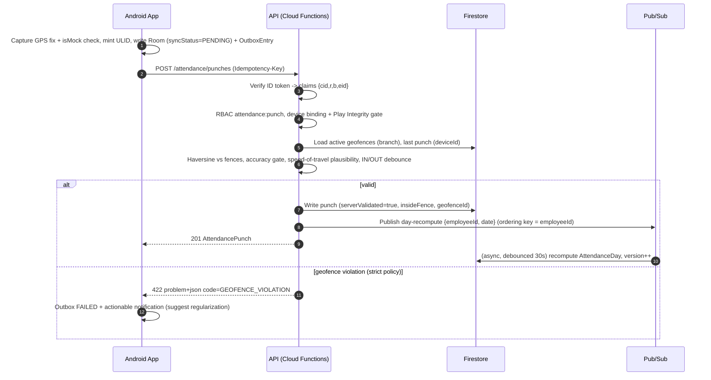
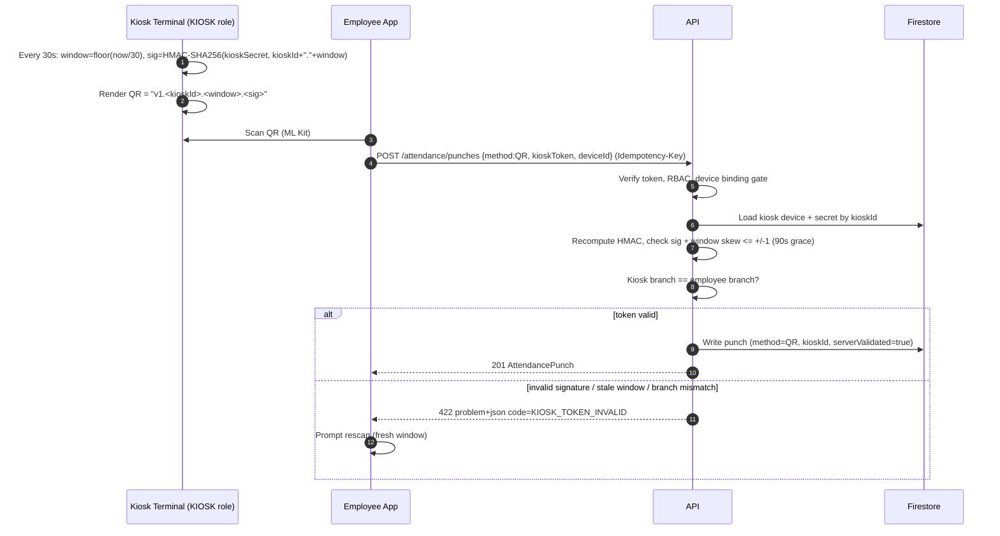
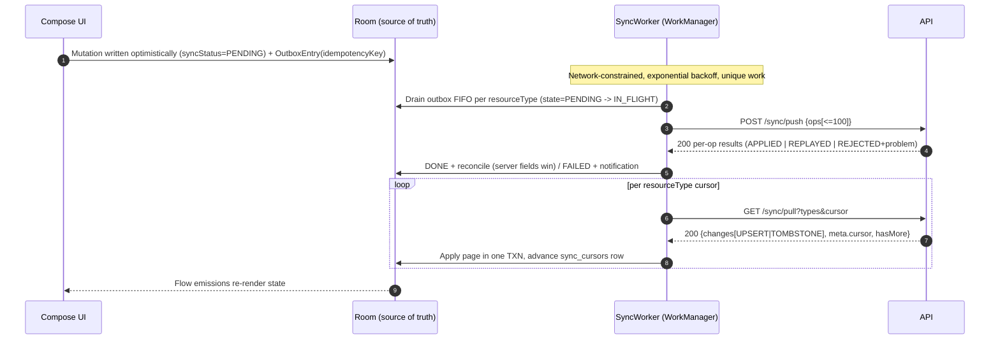

# WorkTrack — REST API Design (v1)

Version: 1.0 · Status: Approved · Owners: Platform Architecture · Derives from: `00-master-spec.md` (§2, §3, §5, §7); entity schemas in `03-database-design.md`

**Purpose.** This document is the binding contract for the WorkTrack REST API served by Cloud Functions (Node 20, TypeScript, Express) at `https://api.worktrack.app/v1` and consumed by the Android app and the Web Admin SPA. It defines the cross-cutting conventions (authentication, tenancy, errors, pagination, idempotency, versioning, rate limits), the complete endpoint reference for every route in master spec §5 with permissions and schemas, full request/response examples for the critical flows, sequence diagrams for the four hardest interactions, and the P4 webhook design. Field names and types are those of `03-database-design.md`; nothing here redefines the data model.

---

## 1. Conventions

### 1.1 Base URL, transport, media types

- Base: `https://api.worktrack.app/v1`. TLS 1.2+ only. All bodies are `application/json; charset=utf-8`; errors are `application/problem+json`.
- Timestamps: RFC 3339 UTC (`2026-07-17T09:02:11.482Z`). Business dates: `yyyy-MM-dd`, interpreted in the relevant branch timezone. Monetary amounts: JSON numbers with at most 2 fraction digits in the resource `currency`.
- All IDs are ULIDs (26-char Crockford base32).

### 1.2 Authentication and tenancy

- `Authorization: Bearer <Firebase ID token>` on every request (no exceptions; there are no anonymous routes).
- Middleware chain per master spec §7: **verify token → load tenant context → RBAC permission check → handler**; deny-by-default.
- Tenant is resolved from the verified custom claims `{ cid, r, b, eid }` — never from the URL alone. Any resource whose `companyId` differs from `cid` yields `TENANT_MISMATCH` (not `NOT_FOUND`, to make cross-tenant probing visible in audit logs; the response body carries no resource data).
- Punch and device endpoints additionally require a non-revoked `Device` binding and an acceptable Play Integrity verdict (master spec §7); failures map to `PERMISSION_DENIED` with `detail` explaining the integrity gate.

### 1.3 Permission model

Permissions are `resource:action` strings (master spec §1.1), bundled into roles. The reference below lists the permission each endpoint requires. **Scope is orthogonal to the permission string**: the RBAC layer intersects the permission with the caller's `RoleAssignment` scope (`COMPANY | BRANCH | DEPARTMENT`) and with self-scope for `EMPLOYEE`-role access (e.g. `payslip:read` as EMPLOYEE returns only `employeeId == eid`). `AUDITOR` holds the `:read` set plus `audit:read`. `SUPER_ADMIN` bypasses tenant scoping via internal tooling only — never through this public surface.

### 1.4 Errors — RFC 7807 `problem+json`

Every non-2xx response is a problem document:

```json
{
  "type": "https://api.worktrack.app/errors/geofence-violation",
  "title": "Punch outside geofence",
  "status": 422,
  "code": "GEOFENCE_VIOLATION",
  "detail": "Location is 412 m from geofence 'HQ Tower' (radius 150 m).",
  "instance": "/v1/attendance/punches",
  "traceId": "8f4c1b2e9d3a4f60",
  "errors": [ { "field": "lat", "reason": "OUTSIDE_FENCE" } ]
}
```

`code` is the machine-stable contract; `type`/`title`/`detail` may evolve. `errors[]` appears only on validation failures. Canonical codes:

| `code` | HTTP | Meaning | Client action |
|---|---|---|---|
| `UNAUTHENTICATED` | 401 | Missing/expired/invalid ID token | Refresh token via Firebase SDK, retry once |
| `PERMISSION_DENIED` | 403 | Authenticated but lacks permission, scope, or device/integrity gate | Do not retry; surface to user |
| `TENANT_MISMATCH` | 403 | URL/body `companyId` ≠ token claim `cid` | Do not retry; forces re-login |
| `VALIDATION_FAILED` | 400 | Body/query fails schema or business validation | Fix input; `errors[]` lists fields |
| `IDEMPOTENCY_REPLAY` | 409 | `Idempotency-Key` reused with a **different** payload | Bug on client; do not retry |
| `GEOFENCE_VIOLATION` | 422 | GPS punch outside every active fence (and policy forbids) | Show distance hint; allow note/regularization |
| `KIOSK_TOKEN_INVALID` | 422 | QR token signature/window/branch check failed | Rescan fresh QR |
| `CONFLICT` | 409 | State conflict: version mismatch, duplicate natural key, illegal status transition | Re-read resource, reconcile, maybe retry |
| `RATE_LIMITED` | 429 | Tier budget exhausted | Back off per `Retry-After` |
| `NOT_FOUND` | 404 | Resource absent or soft-deleted within tenant | Remove local copy on sync |

### 1.5 Pagination envelope

All list endpoints are cursor-based: `?cursor=<opaque>&limit=<1..200, default 50>`. Responses always use the envelope:

```json
{ "data": [ … ], "meta": { "cursor": "eyJ1IjoiMjAyNi0w…", "hasMore": true } }
```

`meta.cursor` is opaque, resource-specific, valid ≥24h, and `null` on the last page. Single-resource responses use `{ "data": {…}, "meta": {} }`. Cursors encode an index position (`updatedAt` + doc name tie-break), never an offset.

### 1.6 Idempotency

- `Idempotency-Key: <ULID>` is honored on **all POSTs** and required on the mutation POSTs the Android outbox emits (`/attendance/punches`, `/leave/requests`, `/attendance/regularizations`, `/shift-swaps`, `/sync/push`, `/payroll/runs`, decide/cancel endpoints).
- The server persists `(cid, key) → response` for 48h. Same key + byte-identical payload ⇒ the stored response is replayed with `Idempotency-Replayed: true` and the original status code. Same key + different payload ⇒ `409 IDEMPOTENCY_REPLAY`.
- Inside `POST /sync/push`, each op's `opId` is its idempotency key (per-op dedupe); the request-level header dedupes the whole batch.

### 1.7 Versioning and deprecation

- Path-versioned (`/v1`). Evolution is **additive only**: new optional fields, new endpoints, new enum values (clients must tolerate unknown enum values and unknown fields).
- Breaking changes require `/v2`. A deprecated endpoint or version emits `Deprecation: true` and `Sunset: <RFC 1123 date>` headers for a minimum **180-day** window, is announced in release notes, and is monitored for traffic before removal.
- Enum value retirement follows the same 180-day rule with dual-emit.

### 1.8 Rate limiting

Enforced per token (per device for kiosk role), fixed-window with burst allowance. Headers on every response: `RateLimit-Limit`, `RateLimit-Remaining`, `RateLimit-Reset`; 429s add `Retry-After`.

| Tier | Applies to | Sustained | Burst |
|---|---|---|---|
| Interactive | All GET/POST from user tokens | 60 req/min | 120 |
| Sync | `/sync/push`, `/sync/pull` | 12 req/min | 24 |
| Punch | `POST /attendance/punches` | 6 req/min | 10 |
| Admin bulk | Org CRUD, rosters PUT, payroll | 120 req/min | 240 |
| Kiosk | `KIOSK`-role token endpoints | 30 req/min per device | 60 |

---

## 2. Endpoint reference

Notation: request/response schemas use `field: type` shorthand; `?` marks optional/nullable. Resource schemas (full field lists) are those of the data dictionary in `03-database-design.md`; server-managed fields (`id` unless client-minted, `companyId`, `createdAt`, `updatedAt`, `deletedAt`, computed fields) are never accepted in request bodies and always present in responses. Every endpoint can return `UNAUTHENTICATED`, `PERMISSION_DENIED`, `TENANT_MISMATCH`, `RATE_LIMITED`; the Errors column lists only endpoint-specific cases.

### 2.1 Session & devices

| Endpoint | Permission | Request | Success | Errors |
|---|---|---|---|---|
| `GET /me` | *(any authenticated)* | — | `200` `{ employee: Employee, company: Company, roles: [{roleCode, scopeType, scopeId?}], permissions: [string], device?: Device }` | — |
| `POST /devices` | `device:bind` | `{ id: ulid, platform: string, model: string, appVersion: string, fcmToken: string, integrityToken: string }` | `201` `Device` | `VALIDATION_FAILED` (integrity verdict unacceptable), `CONFLICT` (binding limit reached) |
| `DELETE /devices/{id}` | `device:revoke` | — | `204` | `NOT_FOUND` |

`GET /me` is the client bootstrap: it returns the effective permission set (mirrored client-side for UX only — enforcement is server-side) and is cached in DataStore, not Room.

### 2.2 Org

CRUD follows one pattern per resource — `GET /{res}` (list, cursor), `GET /{res}/{id}`, `POST /{res}`, `PUT /{res}/{id}`, `DELETE /{res}/{id}` (soft delete):

| Resource | Permissions (list/read · create · update · delete) | Create/update body | Notes |
|---|---|---|---|
| `/branches` | `branch:read` · `branch:create` · `branch:update` · `branch:delete` | `{ name, code, address, lat, lng, radiusM, timezone, status }` | `CONFLICT` on duplicate `code` |
| `/departments` | `department:read` · `department:create` · `department:update` · `department:delete` | `{ name, code, branchId?, parentDepartmentId? }` | `VALIDATION_FAILED` on hierarchy cycle |
| `/positions` | `position:read` · `position:create` · `position:update` · `position:delete` | `{ title, code, level, departmentId? }` | |
| `/employees` | `employee:read` · `employee:create` · `employee:update` · `employee:delete` | `{ employeeCode, firstName, lastName, email, phone, avatarUrl?, branchId, departmentId, positionId, managerId?, employmentType, joinDate }` | Create provisions the Firebase Auth user and claims; `CONFLICT` on duplicate `employeeCode`/`email` |

- `GET /employees?branchId&departmentId&status&q&cursor&limit` — directory search; `q` matches name/code prefix. `200` `{ data: [Employee], meta: { cursor } }`.
- `POST /employees/{id}/deactivate` — `employee:deactivate`. Body `{ exitDate: date, reason: string }`. Sets `status=EXITED`, `exitDate`, revokes devices and refresh tokens, cancels future shift assignments and pending requests. `200` `Employee`. Errors: `CONFLICT` (already `EXITED`), `NOT_FOUND`.

### 2.3 Attendance

| Endpoint | Permission | Request | Success | Errors |
|---|---|---|---|---|
| `POST /attendance/punches` | `attendance:punch` | see §3.1 | `201` `AttendancePunch` | `VALIDATION_FAILED`, `GEOFENCE_VIOLATION`, `KIOSK_TOKEN_INVALID`, `PERMISSION_DENIED` (device revoked / integrity), `CONFLICT` (duplicate direction within debounce) |
| `GET /attendance/punches?employeeId&from&to&cursor&limit` | `attendance:read` | — | `200` `{ data: [AttendancePunch], meta }` | `VALIDATION_FAILED` (range > 92 days) |
| `GET /attendance/days?from&to&employeeId&cursor&limit` | `attendance:read` | — | `200` `{ data: [AttendanceDay], meta }` | `VALIDATION_FAILED` |
| `POST /attendance/regularizations` | `attendance:regularize` | `{ id: ulid, date, requestedInAt?, requestedOutAt?, reason }` (≥1 timestamp) | `201` `RegularizationRequest` (`status=PENDING`, chain built) | `VALIDATION_FAILED`, `CONFLICT` (open request exists for date) |
| `POST /attendance/regularizations/{id}/decide` | `attendance:approve` | `{ decision: "APPROVE"\|"REJECT", comment?: string }` | `200` `RegularizationRequest`; on final APPROVE emits synthetic `MANUAL` punches and recomputes the day | `NOT_FOUND`, `CONFLICT` (not pending / not current approver), `VALIDATION_FAILED` |

### 2.4 Shifts & rosters

| Endpoint | Permission | Request | Success | Errors |
|---|---|---|---|---|
| CRUD `/shifts` | `shift:read` / `shift:create` / `shift:update` / `shift:delete` | `{ name, code, startTime, endTime, breakMinutes, graceInMinutes, graceOutMinutes, overtimePolicyJson, isNight, active }` | standard | `CONFLICT` (duplicate `code`; delete with future assignments) |
| `GET /rosters?branchId&from&to` | `roster:read` | — | `200` `{ data: [ShiftAssignment], meta }` grouped client-side into the grid | `VALIDATION_FAILED` (range > 62 days) |
| `PUT /rosters?branchId&from&to` | `roster:write` | `{ assignments: [{ id: ulid, employeeId, shiftId, date, source }] }` — full replacement of the window | `200` `{ applied: int, removed: int }` | `VALIDATION_FAILED` (employee not in branch; overlapping night shifts), `CONFLICT` (window locked) |
| `POST /shift-swaps` | `shift_swap:create` | `{ id: ulid, assignmentId, targetEmployeeId? }` | `201` `ShiftSwapRequest` (`status=PENDING`) | `VALIDATION_FAILED` (past date), `CONFLICT` (assignment locked / already swapped) |
| `POST /shift-swaps/{id}/decide` | `shift_swap:decide` | `{ decision: "APPROVE"\|"REJECT", comment? }` | `200` `ShiftSwapRequest`; APPROVE rewrites both assignments with `source=SWAP` | `NOT_FOUND`, `CONFLICT` |

### 2.5 Leave

| Endpoint | Permission | Request | Success | Errors |
|---|---|---|---|---|
| `GET /leave/types` | `leave:read` | — | `200` `{ data: [LeaveType], meta }` | — |
| `GET /leave/balances?employeeId` | `leave:read` | — | `200` `{ data: [LeaveBalance], meta }` (current `periodYear`) | `NOT_FOUND` |
| `POST /leave/requests` | `leave:request` | see §3.2 | `201` `LeaveRequest` | `VALIDATION_FAILED` (notice/consecutive/attachment/policy), `CONFLICT` (overlap or insufficient balance) |
| `GET /leave/requests?employeeId&status&from&to&pendingForMe&cursor&limit` | `leave:read` | — | `200` `{ data: [LeaveRequest], meta }`; `pendingForMe=true` = approvals inbox | — |
| `POST /leave/requests/{id}/decide` | `leave:approve` | see §3.3 | `200` `LeaveRequest` | `NOT_FOUND`, `CONFLICT` (not pending / not current approver / balance version race) |
| `POST /leave/requests/{id}/cancel` | `leave:request` (self) or `leave:approve` | `{ reason?: string }` | `200` `LeaveRequest` (`status=CANCELLED`, pending/used days released) | `NOT_FOUND`, `CONFLICT` (already terminal; past-dated beyond policy) |

### 2.6 Payroll

| Endpoint | Permission | Request | Success | Errors |
|---|---|---|---|---|
| `GET /payroll/runs?periodYear&status&cursor&limit` | `payroll:read` | — | `200` `{ data: [PayrollRun], meta }` | — |
| `POST /payroll/runs` | `payroll:run` | see §3.6 | `202` `PayrollRun` (`status=CALCULATING`; async via Cloud Tasks) | `VALIDATION_FAILED`, `CONFLICT` (overlapping run for period/branches) |
| `POST /payroll/runs/{id}/approve` | `payroll:approve` | `{ comment?: string }` | `200` `PayrollRun` (`status=APPROVED`, `approvedBy` set; payslips finalize + PDFs render async) | `NOT_FOUND`, `CONFLICT` (status ≠ `REVIEW`) |
| `GET /payslips?employeeId&year&cursor&limit` | `payslip:read` | — | `200` `{ data: [Payslip], meta }` (self-scoped for EMPLOYEE) | — |
| `GET /payslips/{id}` | `payslip:read` | — | `200` `{ data: { …Payslip, lines: [PayslipLine] }, meta: {} }` | `NOT_FOUND` |

### 2.7 Comms, analytics, audit

| Endpoint | Permission | Request | Success | Errors |
|---|---|---|---|---|
| `GET /announcements?activeOnly&cursor&limit` | `announcement:read` | — | `200` list (audience-filtered) | — |
| `POST /announcements` | `announcement:create` | `{ title, body, audienceJson, publishAt, expiresAt?, priority }` | `201` `Announcement` | `VALIDATION_FAILED` |
| `GET /notifications?unreadOnly&cursor&limit` | `notification:read` (self) | — | `200` `{ data: [NotificationMessage], meta }` | — |
| `POST /notifications/{id}/read` | `notification:read` (self) | — | `200` `NotificationMessage` (`readAt` set; idempotent) | `NOT_FOUND` |
| `GET /analytics/kpis?scope&period` | `analytics:read` | `scope`: `company\|branch:{id}\|department:{id}`; `period`: `yyyy-MM` or `yyyy-'W'ww` | `200` `{ data: { headcount, presentRate, lateRate, absenceRate, avgOvertimeMinutes, leaveUtilization, payrollCost? }, meta: {} }` | `VALIDATION_FAILED` |
| `GET /analytics/insights` | `analytics:read` | — | `200` `{ data: [{ kind, severity, subjectType, subjectId, summary, evidenceJson, generatedAt }], meta }` (P4 populates) | — |
| `GET /audit-logs?resourceType&from&to&actorId&cursor&limit` | `audit:read` | — | `200` `{ data: [AuditLog], meta }` | `VALIDATION_FAILED` (range > 92 days) |

### 2.8 Sync

| Endpoint | Permission | Request | Success | Errors |
|---|---|---|---|---|
| `POST /sync/push` | `sync:push` | see §3.4 | `200` per-op results (batch never fails atomically) | `VALIDATION_FAILED` (malformed batch; >100 ops) |
| `GET /sync/pull?types&cursor&limit` | `sync:pull` | `types`: CSV of resourceTypes | `200` see §3.5 | `VALIDATION_FAILED` (unknown type; expired cursor ⇒ client resets cursor and re-pulls) |

---

## 3. Critical flow examples

### 3.1 `POST /attendance/punches`

**GPS variant** — headers `Authorization`, `Idempotency-Key: 01J2Q9F1QZJ8M4V0T8B3N7XW5D`:

```json
{
  "id": "01J2Q9F1QZJ8M4V0T8B3N7XW5D",
  "type": "IN",
  "method": "GPS",
  "punchedAt": "2026-07-17T09:02:11.482Z",
  "lat": 25.197197,
  "lng": 55.274376,
  "accuracyM": 12.4,
  "isMock": false,
  "deviceId": "01HZX0K3T9RCB6W2P5M8Q4JD7E",
  "note": null
}
```

`201 Created`:

```json
{
  "data": {
    "id": "01J2Q9F1QZJ8M4V0T8B3N7XW5D",
    "companyId": "01HV5M2K8XQ4T9WBCJ6R3ZP0YA",
    "employeeId": "01HW8N4T2YV6RDK9Q1XB5MJ3PC",
    "punchedAt": "2026-07-17T09:02:11.482Z",
    "type": "IN",
    "method": "GPS",
    "lat": 25.197197, "lng": 55.274376, "accuracyM": 12.4,
    "geofenceId": "01HVQ7R2M5XT8B4WNJ0K6YD3PZ",
    "insideFence": true,
    "deviceId": "01HZX0K3T9RCB6W2P5M8Q4JD7E",
    "kioskId": null, "faceScore": null, "photoUrl": null, "note": null,
    "serverValidated": true,
    "invalidReason": null,
    "createdAt": "2026-07-17T09:02:12.010Z",
    "updatedAt": "2026-07-17T09:02:12.010Z"
  },
  "meta": {}
}
```

Failure (`422`, `application/problem+json`): `code: "GEOFENCE_VIOLATION"` as shown in §1.4. Note: tenant policy (`Company.settingsJson`) may instead persist the punch with `serverValidated=false, invalidReason="GEOFENCE_VIOLATION"` and return `201` — the problem response is for the strict-policy default.

**QR kiosk variant** — same endpoint, token replaces coordinates:

```json
{
  "id": "01J2QA0C3VKXW8N5T1RD9B6MYF",
  "type": "IN",
  "method": "QR",
  "punchedAt": "2026-07-17T09:03:40.115Z",
  "kioskToken": "v1.01HVKQ8SK2M7X4TB9WRC5J0DNP.58913127.Gm4qXcVb9tE2LkAzR7yPwQ1sHj8UfNd3oZ6TeKvB0aY",
  "deviceId": "01HZX0K3T9RCB6W2P5M8Q4JD7E"
}
```

`kioskToken` = `v1.<kioskId>.<window>.<base64url(HMAC-SHA256(kioskSecret, kioskId || "." || window))>` where `window = floor(epochSeconds / 30)`. Server verification: signature, window skew ≤ ±1, kiosk branch == employee branch. Success mirrors the GPS response with `kioskId` set and `lat/lng` null; failure is `422 KIOSK_TOKEN_INVALID`.

### 3.2 `POST /leave/requests`

```json
{
  "id": "01J2QB7H5PWXK2M9V4TC8N1RDF",
  "leaveTypeId": "01HVL3A9Q6XT2M8KRB5W7JD0PY",
  "startDate": "2026-08-03",
  "endDate": "2026-08-05",
  "startHalf": false,
  "endHalf": true,
  "reason": "Family travel",
  "attachmentUrl": null
}
```

`201 Created` — server computed `days` (2.5: three days minus the Aug 5 half, no holidays in range), built the chain, debited `pendingDays`:

```json
{
  "data": {
    "id": "01J2QB7H5PWXK2M9V4TC8N1RDF",
    "companyId": "01HV5M2K8XQ4T9WBCJ6R3ZP0YA",
    "employeeId": "01HW8N4T2YV6RDK9Q1XB5MJ3PC",
    "leaveTypeId": "01HVL3A9Q6XT2M8KRB5W7JD0PY",
    "startDate": "2026-08-03", "endDate": "2026-08-05",
    "startHalf": false, "endHalf": true,
    "days": 2.5,
    "reason": "Family travel",
    "attachmentUrl": null,
    "status": "PENDING",
    "approvalChainJson": [
      { "step": 1, "approverId": "01HX2K7M9QTB4W6RCJ3N8VD5PZ", "roleCode": "TEAM_LEAD", "decision": null, "decidedAt": null, "comment": null },
      { "step": 2, "approverId": "01HX9P4R2MKV7T3WBQ8C6JN0YD", "roleCode": "BRANCH_MANAGER", "decision": null, "decidedAt": null, "comment": null }
    ],
    "currentApproverId": "01HX2K7M9QTB4W6RCJ3N8VD5PZ",
    "decidedAt": null,
    "createdAt": "2026-07-17T10:15:03.271Z",
    "updatedAt": "2026-07-17T10:15:03.271Z"
  },
  "meta": {}
}
```

Errors: `400 VALIDATION_FAILED` (`minNoticedays` violated, `maxConsecutiveDays` exceeded, attachment missing while `requiresAttachment`), `409 CONFLICT` (overlapping request, or `pendingDays + usedDays` would exceed balance).

### 3.3 `POST /leave/requests/{id}/decide`

```json
{ "decision": "APPROVE", "comment": "Enjoy the trip" }
```

`200 OK` (intermediate step — chain advances):

```json
{
  "data": {
    "id": "01J2QB7H5PWXK2M9V4TC8N1RDF",
    "status": "PENDING",
    "approvalChainJson": [
      { "step": 1, "approverId": "01HX2K7M9QTB4W6RCJ3N8VD5PZ", "roleCode": "TEAM_LEAD", "decision": "APPROVE", "decidedAt": "2026-07-17T11:40:22.905Z", "comment": "Enjoy the trip" },
      { "step": 2, "approverId": "01HX9P4R2MKV7T3WBQ8C6JN0YD", "roleCode": "BRANCH_MANAGER", "decision": null, "decidedAt": null, "comment": null }
    ],
    "currentApproverId": "01HX9P4R2MKV7T3WBQ8C6JN0YD",
    "decidedAt": null,
    "updatedAt": "2026-07-17T11:40:22.905Z"
  },
  "meta": {}
}
```

When the **final** approver approves: transaction moves `days` from `pendingDays` to `usedDays` on `LeaveBalance` (guarded by `version`), sets `status=APPROVED`, `currentApproverId=null`, `decidedAt`, marks affected `AttendanceDay` rows `LEAVE`, and notifies the employee. A `REJECT` at any step is terminal: `status=REJECTED`, `pendingDays` released. `409 CONFLICT` if the caller is not `currentApproverId` or the request already reached a terminal status.

### 3.4 `POST /sync/push`

Batched outbox drain (≤100 ops, FIFO per resourceType). `opId` is the per-op idempotency key (the outbox row's `idempotencyKey`):

```json
{
  "deviceId": "01HZX0K3T9RCB6W2P5M8Q4JD7E",
  "ops": [
    {
      "opId": "01J2QC1M8TWXV5K2N9RB4D7PYF",
      "opType": "CREATE",
      "resourceType": "punches",
      "resourceId": "01J2QC1M8TWXV5K2N9RB4D7PYF",
      "payload": { "type": "OUT", "method": "GPS", "punchedAt": "2026-07-16T18:31:07.220Z", "lat": 25.197201, "lng": 55.274390, "accuracyM": 9.8, "isMock": false, "deviceId": "01HZX0K3T9RCB6W2P5M8Q4JD7E" }
    },
    {
      "opId": "01J2QC2P4VKXW9M3T6RD8B1NYC",
      "opType": "CREATE",
      "resourceType": "leaveRequests",
      "resourceId": "01J2QC2P4VKXW9M3T6RD8B1NYC",
      "payload": { "leaveTypeId": "01HVL3A9Q6XT2M8KRB5W7JD0PY", "startDate": "2026-09-01", "endDate": "2026-09-01", "startHalf": false, "endHalf": false, "reason": "Medical appointment" }
    },
    {
      "opId": "01J2QC3R7YWXK4V8N2TB6D9MPF",
      "opType": "CREATE",
      "resourceType": "punches",
      "resourceId": "01J2QC3R7YWXK4V8N2TB6D9MPF",
      "payload": { "type": "IN", "method": "GPS", "punchedAt": "2026-07-17T08:59:41.006Z", "lat": 24.991102, "lng": 55.146800, "accuracyM": 8.1, "isMock": false, "deviceId": "01HZX0K3T9RCB6W2P5M8Q4JD7E" }
    }
  ]
}
```

`200 OK` — the batch itself always succeeds; each op reports independently:

```json
{
  "data": {
    "results": [
      { "opId": "01J2QC1M8TWXV5K2N9RB4D7PYF", "status": "APPLIED",  "resourceType": "punches", "resource": { "id": "01J2QC1M8TWXV5K2N9RB4D7PYF", "serverValidated": true, "insideFence": true, "updatedAt": "2026-07-17T12:00:04.118Z" } },
      { "opId": "01J2QC2P4VKXW9M3T6RD8B1NYC", "status": "REPLAYED", "resourceType": "leaveRequests", "resource": { "id": "01J2QC2P4VKXW9M3T6RD8B1NYC", "status": "PENDING", "days": 1.0, "updatedAt": "2026-07-17T07:44:51.930Z" } },
      { "opId": "01J2QC3R7YWXK4V8N2TB6D9MPF", "status": "REJECTED", "resourceType": "punches",
        "problem": { "type": "https://api.worktrack.app/errors/geofence-violation", "title": "Punch outside geofence", "status": 422, "code": "GEOFENCE_VIOLATION", "detail": "Location is 18.4 km from nearest active geofence." } }
    ]
  },
  "meta": {}
}
```

Client contract per master spec §6.3: `APPLIED`/`REPLAYED` ⇒ outbox row `DONE`, local row reconciled (`syncStatus=SYNCED`, server fields win). `REJECTED` ⇒ outbox row `FAILED`, local row flagged, actionable notification raised — never silent loss. Ops for the same `resourceType` are applied in array order.

### 3.5 `GET /sync/pull?types=attendanceDays,leaveRequests,notifications&cursor=eyJ3IjoiMjAyNi0wNy0xN1QwNzo0NDo1MS45MzBaIn0&limit=200`

`200 OK`:

```json
{
  "data": {
    "changes": [
      { "type": "attendanceDays", "op": "UPSERT",
        "doc": { "id": "01J2QCX0M4TWK8V2N7RB5D9PYA", "employeeId": "01HW8N4T2YV6RDK9Q1XB5MJ3PC", "date": "2026-07-16", "shiftId": "01HVJ2M8QK4XT6WB9RC3N5D0PZ", "firstInAt": "2026-07-16T08:57:02.310Z", "lastOutAt": "2026-07-16T18:31:07.220Z", "workedMinutes": 514, "breakMinutes": 60, "lateMinutes": 0, "earlyOutMinutes": 0, "overtimeMinutes": 34, "status": "PRESENT", "computedAt": "2026-07-17T12:00:05.402Z", "version": 3, "updatedAt": "2026-07-17T12:00:05.402Z" } },
      { "type": "leaveRequests", "op": "UPSERT",
        "doc": { "id": "01J2QB7H5PWXK2M9V4TC8N1RDF", "status": "PENDING", "currentApproverId": "01HX9P4R2MKV7T3WBQ8C6JN0YD", "days": 2.5, "updatedAt": "2026-07-17T11:40:22.905Z" } },
      { "type": "notifications", "op": "UPSERT",
        "doc": { "id": "01J2QD5T9WKXV3M8N4RB7C2PYE", "kind": "LEAVE_STEP_APPROVED", "title": "Leave request update", "body": "Step 1 of 2 approved", "dataJson": { "deepLink": "worktrack://leave/requests/01J2QB7H5PWXK2M9V4TC8N1RDF" }, "readAt": null, "sentAt": "2026-07-17T11:40:23.512Z", "updatedAt": "2026-07-17T11:40:23.512Z" } },
      { "type": "leaveRequests", "op": "TOMBSTONE", "id": "01J1XR8K2MTWV6N9B4C7D5PYQZ", "deletedAt": "2026-07-17T09:12:44.008Z" }
    ]
  },
  "meta": { "cursor": "eyJ3IjoiMjAyNi0wNy0xN1QxMjowMDowNS40MDJaIiwibiI6InMwN18wMUoyUUNYMCJ9", "hasMore": false }
}
```

Changes are ordered by `updatedAt` across the requested types; the cursor is a per-type watermark bundle. The client applies each page in one Room transaction, then persists `meta.cursor` into `sync_cursors`. `TOMBSTONE` deletes the local row. An expired cursor returns `VALIDATION_FAILED` with `errors[0].reason="CURSOR_EXPIRED"`; the client clears the cursor and performs a windowed re-pull (bounded by Room retention windows, `03-database-design.md` §6.1).

### 3.6 `POST /payroll/runs`

```json
{
  "id": "01J2QE8V2MKXT7W4N9RB3C6PYD",
  "periodYear": 2026,
  "periodMonth": 7,
  "branchIds": ["01HV7B3M9QKX2T4WRC8N6JD1PZ", "01HV7B4N0RLY3U5XSD9P7KE2QA"]
}
```

`202 Accepted` — calculation dispatched to Cloud Tasks; poll `GET /payroll/runs` or await the notification:

```json
{
  "data": {
    "id": "01J2QE8V2MKXT7W4N9RB3C6PYD",
    "companyId": "01HV5M2K8XQ4T9WBCJ6R3ZP0YA",
    "periodYear": 2026, "periodMonth": 7,
    "branchIdsJson": ["01HV7B3M9QKX2T4WRC8N6JD1PZ", "01HV7B4N0RLY3U5XSD9P7KE2QA"],
    "status": "CALCULATING",
    "startedBy": "01HXPAYADM4T7W2KRB9C3N6QYD",
    "approvedBy": null,
    "totalsJson": null,
    "lockedAt": null,
    "createdAt": "2026-07-17T13:05:10.660Z",
    "updatedAt": "2026-07-17T13:05:10.660Z"
  },
  "meta": {}
}
```

The job snapshots `EmployeeSalary` (effective-dated), `AttendanceDay`, and approved leave for the period; writes one `Payslip` + `PayslipLine`s per employee (`status=DRAFT`); fills `totalsJson`; transitions the run to `REVIEW`. `POST /payroll/runs/{id}/approve` then finalizes payslips and renders PDFs. `409 CONFLICT` if a non-`CLOSED` run overlaps the same period and any of the same branches.

---

## 4. Sequence diagrams

### 4.1 GPS punch validation



### 4.2 QR kiosk TOTP flow



### 4.3 Leave approval chain

```mermaid
sequenceDiagram
    autonumber
    participant Emp as Employee App
    participant API as API
    participant FS as Firestore
    participant TL as Team Lead
    participant BM as Branch Manager

    Emp->>API: POST /leave/requests
    API->>FS: Load policy, balance, holidays; compute days
    API->>FS: TXN: create request (PENDING, chain[TL,BM]), balance.pendingDays += days (version check)
    API-->>Emp: 201 LeaveRequest (currentApproverId=TL)
    API->>TL: NotificationMessage (deep link worktrack://approvals)
    TL->>API: POST /leave/requests/{id}/decide {APPROVE}
    API->>FS: Update chain step 1, currentApproverId=BM
    API->>BM: NotificationMessage
    BM->>API: POST /leave/requests/{id}/decide {APPROVE}
    API->>FS: TXN: status=APPROVED, decidedAt; balance.pendingDays -= days, usedDays += days (version check); AttendanceDay(range).status=LEAVE
    API->>Emp: NotificationMessage LEAVE_DECIDED
    Note over API,FS: Any REJECT is terminal - status=REJECTED, pendingDays released, employee notified
```

### 4.4 Offline sync push/pull cycle



---

## 5. Webhooks (P4 — design sketch)

Outbound webhooks ship with the open-API program in P4 (master spec §8). Design is fixed now so P0–P3 event producers emit compatible internal events.

### 5.1 Event catalog

Event names are `resource.action`, versioned by payload schema (`specversion` per event):

| Event | Fired when | Payload core |
|---|---|---|
| `employee.created` / `employee.updated` / `employee.deactivated` | Org lifecycle | Employee (PII-minimized: id, employeeCode, org placement, status) |
| `attendance.punch.recorded` | Punch persisted (valid or not) | Punch incl. `serverValidated`, `invalidReason` |
| `attendance.day.computed` | AttendanceDay (re)computed | AttendanceDay |
| `attendance.regularization.decided` | Terminal decision | RegularizationRequest |
| `leave.request.submitted` / `leave.request.decided` / `leave.request.cancelled` | Leave lifecycle | LeaveRequest + delta of balance effect |
| `shift.swap.decided` | Swap approved/rejected | ShiftSwapRequest + affected assignments |
| `payroll.run.status_changed` | Any run transition (`CALCULATING→REVIEW→APPROVED→PAID→CLOSED`) | PayrollRun (totalsJson included from REVIEW) |
| `payslip.finalized` | Payslip goes FINAL | Payslip (no lines; fetch via API) |
| `announcement.published` | `publishAt` reached | Announcement |

Delivery: per-tenant endpoint registrations with per-event subscriptions; at-least-once via Cloud Tasks with exponential backoff (max 24h, then dead-letter + admin notification); consumers must be idempotent on `eventId` (ULID).

### 5.2 Envelope and signature

```json
{
  "eventId": "01JABCXYZ0M4TWK8V2N7RB5DQP",
  "event": "leave.request.decided",
  "specversion": "1.0",
  "companyId": "01HV5M2K8XQ4T9WBCJ6R3ZP0YA",
  "occurredAt": "2026-07-17T11:58:00.412Z",
  "data": { … }
}
```

Headers:

```
X-WorkTrack-Event: leave.request.decided
X-WorkTrack-Delivery: 01JABD0FQ2…        (unique per attempt)
X-WorkTrack-Timestamp: 1784721480        (unix seconds, signing time)
X-WorkTrack-Signature: v1=hex(HMAC-SHA256(endpointSecret, timestamp + "." + rawBody))
```

Verification rules for consumers: (1) recompute the HMAC over the **raw** body with the shared `endpointSecret` (issued at registration, rotatable with dual-signing overlap `v1=…,v1=…`); (2) constant-time compare; (3) reject if `|now − timestamp| > 300s` (replay protection); (4) dedupe on `eventId`. Failed signature or stale timestamp must return 4xx so the delivery is not retried against a misconfigured secret indefinitely; WorkTrack alerts the tenant admin after 10 consecutive signature failures.
