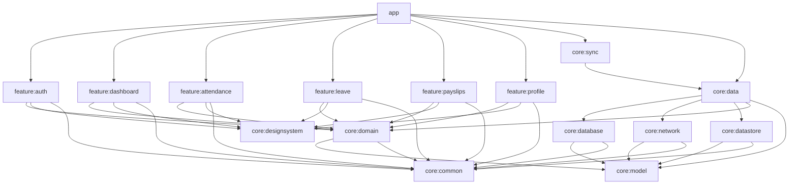
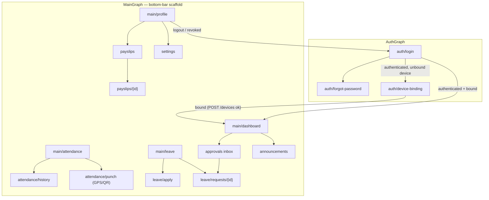

# WorkTrack — Android App Architecture & Navigation

Version: 1.0 · Status: Approved · Derives from: `00-master-spec.md` (§2, §6)

**Purpose.** This document specifies the Android application architecture for WorkTrack: the Clean Architecture layering and Gradle module graph, the convention-plugin build system, the MVVM/UDF presentation contract, the complete navigation design (routes, arguments, deep links, role gating, state preservation), offline-first behavior per screen, runtime permission handling with the Play Integrity integration point, and the testing strategy. It is binding for all Android code in this repository; deviations require an update to this document and, where applicable, to the master spec first.

---

## 1. Architectural principles

1. **Clean Architecture, dependency rule inward.** UI depends on domain; domain depends on nothing Android-specific; data implements domain contracts. No feature module ever touches Room, Retrofit, or DataStore directly.
2. **Offline-first.** Room is the single local source of truth (master spec §6.3). Every screen renders from Room `Flow`s; the network only feeds Room via sync, never the UI directly.
3. **Unidirectional data flow (UDF).** State flows down as a single immutable `UiState`; events flow up as a sealed `UiEvent`; one-shot effects are delivered exactly once.
4. **Server-authoritative money paths.** Attendance validity, leave balances, and payslips are read-only projections on the client; the app proposes, the server decides (master spec §3).
5. **Composable isolation.** Screens are stateless; all state hoisting terminates at the ViewModel. This makes every screen previewable, screenshot-testable, and reusable in kiosk mode (P1).

### 1.1 Layering

| Layer | Modules | Contents | Allowed dependencies |
|---|---|---|---|
| Feature (UI) | `feature:auth`, `feature:dashboard`, `feature:attendance`, `feature:leave`, `feature:payslips`, `feature:profile` | Compose screens, ViewModels, per-feature nav graphs | `core:domain`, `core:designsystem`, `core:common` |
| Domain | `core:domain` | Use cases, repository **interfaces**, domain policies (e.g. punch eligibility) | `core:model`, `core:common` |
| Data | `core:data` | Repository implementations, mappers, offline write pipeline (Room + outbox enqueue) | `core:database`, `core:network`, `core:datastore`, `core:domain`, `core:model` |
| Data sources | `core:database` (Room), `core:network` (Retrofit/OkHttp), `core:datastore` (Proto DataStore) | DAOs/entities, API services/DTOs, preferences | `core:model`, `core:common` |
| Sync | `core:sync` | WorkManager workers, outbox processor, cursor pull, scheduling | `core:data` |
| Cross-cutting | `core:model` (entities/value types), `core:common` (`Result`, dispatchers, time/Clock abstraction), `core:designsystem` (M3 theme + components) | — | `core:model` → nothing; `core:common` → nothing |

`app` composes everything: root `NavHost`, main scaffold, Hilt application, WorkManager initialization, deep-link intent filters.

## 2. Gradle module graph

Exactly the graph from master spec §6.1:



Rules enforced in CI (dependency-guard / `checkModuleGraph` task):

- `feature:*` may not depend on `core:data`, `core:database`, `core:network`, `core:datastore`, `core:sync`, or another `feature:*`.
- `core:domain` has zero Android framework dependencies (pure Kotlin/JVM module; `SavedStateHandle` and `Flow` types come from KMP-safe artifacts only).
- Only `app` depends on `core:sync`; features trigger sync through the `SyncRequester` interface in `core:domain`, implemented in `core:sync` and bound in `app`.
- `core:designsystem` contains no business logic and no ViewModels.

## 3. Build logic — convention plugins

All build configuration lives in `build-logic/` as composite-build convention plugins (master spec §6.1):

| Plugin id | Applies to | Provides |
|---|---|---|
| `worktrack.android.application` | `app` | AGP application config, SDK levels (min 26 / target latest stable), signing config plumbing, R8 rules, build types (`debug`, `benchmark`, `release`) |
| `worktrack.android.library` | all `core:*` Android modules | AGP library config, Kotlin 2.x compiler options (`-Xjvm-default=all`, explicit API mode for `core:domain`/`core:model`), lint baseline |
| `worktrack.android.library.compose` | `core:designsystem`, any library with UI | Compose compiler wiring, compose BOM, metrics/reports flags |
| `worktrack.android.feature` | all `feature:*` | = library + compose + hilt + default deps on `core:domain`, `core:designsystem`, `core:common`, navigation-compose, lifecycle |
| `worktrack.android.hilt` | any module with DI | Hilt + KSP wiring |
| `worktrack.android.room` | `core:database` | Room + KSP, schema export dir (`schemas/`, checked in for migration tests) |

Why convention plugins rather than `subprojects {}` blocks or shared `.gradle` scripts:

1. **Single point of change.** SDK bump, Kotlin upgrade, or a new lint rule is one edit in `build-logic`, not 16 build files.
2. **Type-safe and testable.** Plugins are Kotlin classes; misconfiguration fails compilation of `build-logic`, not a runtime surprise mid-build.
3. **Feature-module cost is near zero.** A new feature's `build.gradle.kts` is ~5 lines (`id("worktrack.android.feature")` + one namespace), which keeps the module graph honest — nobody skips modularization because setup is tedious.
4. **Configuration-cache and build-scan friendly.** No cross-project configuration; every module is isolated, enabling parallel configuration and remote build cache hits.

Versions are centralized in `gradle/libs.versions.toml`; convention plugins read the catalog, so modules never declare raw coordinates.

## 4. Presentation contract (MVVM + UDF)

Every screen follows one contract, with no exceptions:

```kotlin
// 1. Single immutable state — the only thing the screen renders.
data class LeaveApplyUiState(
    val leaveTypes: List<LeaveTypeUi> = emptyList(),
    val balances: Map<String, LeaveBalanceUi> = emptyMap(),
    val form: LeaveFormUi = LeaveFormUi(),
    val submitInProgress: Boolean = false,
    val isOffline: Boolean = false,
    val error: UiText? = null,
)

// 2. Sealed events — the only way the screen talks to the ViewModel.
sealed interface LeaveApplyEvent {
    data class TypeSelected(val leaveTypeId: String) : LeaveApplyEvent
    data class DatesChanged(val start: LocalDate, val end: LocalDate) : LeaveApplyEvent
    data object Submit : LeaveApplyEvent
}

// 3. One-shot effects — navigation, snackbars, system dialogs.
sealed interface LeaveApplyEffect {
    data class NavigateToDetail(val requestId: String) : LeaveApplyEffect
    data class ShowSnackbar(val message: UiText) : LeaveApplyEffect
}

@HiltViewModel
class LeaveApplyViewModel @Inject constructor(
    private val applyLeave: ApplyLeaveUseCase,
    observeLeaveTypes: ObserveLeaveTypesUseCase,
    observeBalances: ObserveLeaveBalancesUseCase,
    private val savedStateHandle: SavedStateHandle,
) : ViewModel() {
    val uiState: StateFlow<LeaveApplyUiState> = /* combine(...).stateIn(
        viewModelScope, SharingStarted.WhileSubscribed(5_000), LeaveApplyUiState()) */
    private val _effects = Channel<LeaveApplyEffect>(Channel.BUFFERED)
    val effects: Flow<LeaveApplyEffect> = _effects.receiveAsFlow()
    fun onEvent(event: LeaveApplyEvent) { /* ... */ }
}
```

Contract rules:

- **One `StateFlow<UiState>` per ViewModel.** No secondary `LiveData`, no exposed `MutableStateFlow`, no per-field flows. `stateIn(WhileSubscribed(5_000))` so upstream Room flows stop when the screen leaves composition (survives rotation without restart).
- **Effects via `Channel(BUFFERED).receiveAsFlow()`**, collected in the screen with `LaunchedEffect` + `repeatOnLifecycle(STARTED)`. Effects are for things that must happen exactly once (navigate, snackbar, permission launch). Anything renderable belongs in `UiState` instead.
- **Screens are stateless composables**: `LeaveApplyScreen(state: LeaveApplyUiState, onEvent: (LeaveApplyEvent) -> Unit)`. A thin `LeaveApplyRoute` composable owns the ViewModel, collects state with `collectAsStateWithLifecycle()`, and wires effects to the `NavController`/`SnackbarHostState`. Only `*Route` composables may reference a ViewModel.
- **Form/transient input survives process death** via `SavedStateHandle` (see §5.5); domain data never does — it re-materializes from Room.
- **Loading is modeled, not implied.** `UiState` uses explicit sub-states (`isOffline`, `submitInProgress`, `error: UiText?`); no screen infers loading from null.
- **`UiText`** wraps string resources vs. raw server strings so composables stay context-free and testable.

Use cases in `core:domain` are single-verb classes (`ApplyLeaveUseCase`, `RecordPunchUseCase`, `ObserveAttendanceDaysUseCase`) with `operator fun invoke`. Commands return `Result<T>` from `core:common`; observations return `Flow<T>`. ViewModels never call repositories directly.

## 5. Navigation

Root structure per master spec §6.2: `AuthGraph` (Login → ForgotPassword → DeviceBinding) → `MainGraph` with a bottom-bar scaffold (**Dashboard**, **Attendance**, **Leave**, **Profile**) and nested destinations.

### 5.1 Route table

Routes are defined as type-safe `@Serializable` destinations (Navigation-Compose 2.8+); the patterns below are the canonical string forms and deep-link URIs.

| Route pattern | Args | Deep link | Entry points | Role gating |
|---|---|---|---|---|
| `auth/login` | — | — | App start (unauthenticated) | none |
| `auth/forgot-password` | — | — | Login | none |
| `auth/device-binding` | — | — | Post-login when no bound `Device` for this install | authenticated, pre-main |
| `main/dashboard` | — | — | Bottom bar (start destination) | any authenticated |
| `main/attendance` | — | — | Bottom bar; dashboard punch card | any authenticated |
| `main/attendance/history?from={date}&to={date}` | `from`, `to` optional ISO dates | — | Attendance hub; dashboard "this week" card | self only |
| `main/attendance/punch?method={method}` | `method ∈ {GPS, QR}` (FACE in P1) | — | Attendance hub CTA; dashboard quick action | `attendance:punch` (all employees) |
| `main/leave` | — | — | Bottom bar | any authenticated |
| `main/leave/apply` | — | — | Leave hub CTA | `leave:request` |
| `main/leave/requests/{requestId}` | `requestId` (ULID) | `worktrack://leave/requests/{id}` | Leave list; push notification; approvals inbox | self, or approver on the request's chain |
| `main/approvals` | — | `worktrack://approvals` | Dashboard badge card; push notification | any of `TEAM_LEAD`, `BRANCH_MANAGER`, `HR_ADMIN`, `COMPANY_ADMIN` (client mirror of `leave:approve` / `attendance:approve`) |
| `main/payslips` | — | — | Profile section; dashboard card | `payroll:read-self` |
| `main/payslips/{payslipId}` | `payslipId` (ULID) | `worktrack://payslips/{id}` | Payslip list; push notification | owner of the payslip |
| `main/announcements` | — | — | Dashboard feed "see all"; notification | any authenticated |
| `main/profile` | — | — | Bottom bar | any authenticated |
| `main/settings` | — | — | Profile top-bar action | any authenticated |

Deep-link handling: `app` declares the `worktrack://` scheme intent filter. On cold start, `MainActivity` hands the intent to the `NavHost`; if the session is invalid the pending destination is stored in `SavedStateHandle` of the auth flow and replayed after login + device binding. Role-gated deep links (e.g. `worktrack://approvals` sent to an `EMPLOYEE` whose lead role was revoked) resolve to Dashboard with an explanatory snackbar — the server remains the enforcement point; client gating is UX only (master spec §1.1).

### 5.2 Nav graph



`AuthGraph` and `MainGraph` are separate nested graphs on the root `NavHost`. Successful auth executes `navigate(MainGraph) { popUpTo(AuthGraph) { inclusive = true } }` so back never returns to Login. Session revocation (401 with terminal reason from `GET /me`, or Firebase token revoked) clears Room user-scoped tables, cancels sync work, and pops to `AuthGraph` the same way in reverse.

### 5.3 Bottom bar behavior

- Visible only for the four top-level destinations (`dashboard`, `attendance`, `leave`, `profile`); hidden on all nested destinations (punch flow, detail screens) via `currentBackStackEntryAsState()` route matching.
- Tab switch uses the standard M3 pattern: `navigate(tab) { popUpTo(navController.graph.findStartDestination().id) { saveState = true }; launchSingleTop = true; restoreState = true }` — each tab keeps an independent back stack; re-selecting the current tab pops that tab's stack to its root.
- Approvals inbox is **not** a tab; it is reached from the Dashboard approvals card (badge shows pending count from Room) and via deep link, keeping the bar identical for all roles.
- System back on a tab root (other than Dashboard) returns to Dashboard; back on Dashboard exits the app.

### 5.4 State preservation

- Tab back stacks: `saveState`/`restoreState` as above; Compose `rememberSaveable` preserves scroll positions (`LazyListState`) and expanded/collapsed UI within stops.
- ViewModels use `SharingStarted.WhileSubscribed(5_000)` so configuration changes never re-trigger loads; Room flows re-attach instantly with the last cached emission.

### 5.5 Process death (SavedStateHandle)

| Concern | Mechanism |
|---|---|
| Current destination + back stacks | Navigation-Compose saves the nav state to the Activity's saved instance state automatically |
| In-progress form input (leave apply dates/reason, regularization note, search queries) | ViewModel writes each field to `SavedStateHandle` keys on change; state builder reads `savedStateHandle.getStateFlow(key, default)` and combines it with Room flows |
| In-flight punch | Never held in memory only: `RecordPunchUseCase` writes Room + `OutboxEntry` transactionally *before* any UI acknowledgment, so process death after tap loses nothing (see doc `08-sync-strategy.md` §3) |
| Pending deep link during auth | Stored in `SavedStateHandle` of `AuthGraph`'s shared back-stack entry, replayed post-binding |
| Domain data | Never saved to instance state — re-materializes from Room; instance state stays under the transaction size budget |

## 6. Offline-first behavior per screen

Master spec §6.3 governs; per-screen specifics:

| Screen | Renders from Room | Requires network | Offline mutation pattern |
|---|---|---|---|
| Dashboard | Today's `AttendanceDay`, own punches, `LeaveBalance`, latest `Announcement`s, pending approvals count | No — fully cached; freshness label shows `lastSyncedAt` when stale > 15 min | n/a (read-only) |
| Punch — GPS | Shift context (`ShiftAssignment`), geofences for the employee's branch | No for capture; GPS fix is local. `insideFence` computed on-device against cached `Geofence` rows | **Optimistic punch**: insert `AttendancePunch(serverValidated=false)` + outbox entry in one Room transaction; UI confirms immediately with "Recorded — will verify when online" chip; `serverValidated`/`invalidReason` reconcile on push ack. Punches are append-only: no local edit/delete ever |
| Punch — QR kiosk | Kiosk scan UX | **Yes** (soft requirement): the TOTP QR window is 30 s, so validation is near-real-time; offline QR punches are still queued, and the server accepts tokens within a bounded clock-skew grace, else rejects with actionable notification | Same optimistic insert; higher rejection probability is surfaced up front ("QR punches need connectivity soon") |
| Attendance history | `AttendanceDay` + punches for range | No; pull-to-refresh triggers expedited sync | Regularization request (P1) follows the leave-apply pattern |
| Leave hub / balances | `LeaveType`, `LeaveBalance`, own `LeaveRequest`s | No | — |
| Leave apply | Types, balances, holiday calendar for date validation | No to submit | **Optimistic apply**: insert `LeaveRequest(status=PENDING, syncStatus=PENDING)` + outbox entry; balance shows a local `pendingDays` overlay clearly marked "pending sync"; server rejection (e.g. stale balance) flips the row to `REJECTED` with reason and raises a notification — never silent (master spec §6.3.6) |
| Leave detail | Request row + approval chain JSON | No | Cancel = optimistic status change + outbox op |
| Approvals inbox | Pending `LeaveRequest`/`RegularizationRequest` where user is `currentApproverId` | No to view; decisions queue offline | Decide = optimistic status + outbox `decide` op; conflicting decision (someone else decided first) is server-rejected and reconciled with a notification |
| Payslips list/detail | `Payslip` + `PayslipLine` rows | PDF download (`pdfUrl`) requires network; cached after first fetch | n/a — payslips are server-authoritative, read-only |
| Announcements | `Announcement` rows | No | Read receipts queue via outbox (`POST /notifications/{id}/read`) |
| Profile / settings | `Employee` row, bound `Device` | Avatar upload requires network | Editable profile fields: optimistic Room update + outbox; last-write-wins on the server for these fields (doc 08 §6) |
| Auth / device binding | — | **Yes** — Firebase Auth and `POST /devices` are online-only by design | n/a |

Global rules:

- A persistent, non-blocking offline indicator (top of scaffold) appears when connectivity is lost; screens never block on it.
- `syncStatus` renders as a subtle per-row glyph (pending ⟳ / failed ⚠) on user-owned mutable rows; tapping a failed row shows the error and a retry action.
- No screen issues a direct network call for domain data. The only non-sync network calls are Firebase Auth, device binding, file transfers (avatar, payslip PDF, leave attachment), and Play Integrity.

## 7. Permissions & Play Integrity

### 7.1 Runtime permissions

| Permission | Feature | Strategy |
|---|---|---|
| `ACCESS_FINE_LOCATION` (+ `ACCESS_COARSE_LOCATION` fallback) | GPS punch, geofence check | Requested **in-context** on first GPS punch attempt, never at onboarding. Pre-request rationale sheet explains: location is captured only at the moment of punching, never tracked in background. If the user selects "approximate only" (Android 12+), the punch flow explains that fine accuracy is required for geofence validation and offers the settings shortcut; a coarse-only punch is still recorded but flagged (`accuracyM` high) for server-side review rather than blocked. Permanent denial → punch method selector hides GPS with an inline explanation and offers QR |
| `CAMERA` | QR kiosk scan; face verification capture (P1) | Requested when the user opens the QR scanner. Rationale: "camera is used only to scan the kiosk code / verify it's you; images are processed on-device" (face capture handling per doc `07-security-architecture.md` §6.6) |
| `POST_NOTIFICATIONS` (API 33+) | Approvals, sync rejection alerts, announcements | Requested after first successful login, from a dismissible dashboard card explaining what notifications carry. Denial degrades to in-app notification center only (`GET /notifications` data still syncs) |

Implementation: a single `PermissionGate` composable in `core:designsystem` renders rationale → system dialog → denial fallback as a state machine, driven by an effect from the ViewModel (`RequestPermission` effect) so permission flows stay testable. No background location is ever requested; the manifest never includes `ACCESS_BACKGROUND_LOCATION`.

### 7.2 Play Integrity integration point

- `IntegrityTokenProvider` (interface in `core:domain`, implementation in `core:data` wrapping the Play Integrity **standard request** API) warms up a token provider at app start and produces a token on demand.
- `RecordPunchUseCase` requires an integrity token: the token (or a structured `UNAVAILABLE` marker with reason) is stored on the `OutboxEntry` payload for the punch and sent to `POST /attendance/punches`; the server decodes the verdict and persists it on the `Device`/punch (master spec §7). Tokens are bound to a server-issued nonce fetched during device binding and rotated on each sync session to prevent replay.
- Device binding (`POST /devices`) sends the first integrity verdict; the server may refuse binding on `MEETS_NO_INTEGRITY`. Client behavior on failure is defined in doc `07-security-architecture.md` §6.2 — the app degrades to "punch recorded, subject to review", never hard-crashes on Integrity API unavailability (e.g. no Play Services).
- Mock-location detection: `Location.isMock` (API 31+; `isFromMockProvider` before) is captured per GPS fix and transmitted with the punch payload; detection is advisory client-side, enforced server-side.

## 8. Testing strategy

| Level | Scope | Tooling | Gate |
|---|---|---|---|
| Unit — domain | Use cases, policies (punch eligibility, leave day counting incl. half-days/holidays) | JUnit5, kotlinx-coroutines-test, fake repositories | PR-blocking; ≥ 90% line coverage in `core:domain` |
| Unit — ViewModels | State reduction, event handling, effect emission | **Turbine** for `uiState`/`effects` flows; `MainDispatcherRule`; `SavedStateHandle` restoration cases (create VM with pre-seeded handle, assert form state) | PR-blocking |
| Room DAO | Every DAO query, migrations | `Room.inMemoryDatabaseBuilder` under Robolectric for query tests; `MigrationTestHelper` against checked-in `schemas/` for every schema bump; FIFO ordering + transaction atomicity tests for outbox DAO | PR-blocking; a schema change without a migration test fails CI |
| Screenshot | Every `core:designsystem` component and each feature screen's canonical states (loading/empty/error/content, light/dark, small+large font scale, en + one RTL locale) | **Paparazzi** (JVM, no emulator); golden images checked in; `verifyPaparazzi` in CI, `recordPaparazzi` to update with review | PR-blocking on pixel diff |
| Sync end-to-end | Full outbox → push → pull → reconcile loop | JVM integration tests in `core:sync`: real Room (in-memory) + real OkHttp against **MockWebServer scripted as a fake WorkTrack server** (idempotency-key replay returns same result; 409 conflict; 422 rejection; 500 then success for backoff). Scenarios: offline punch burst then reconnect; duplicate delivery; leave apply rejected on stale balance surfaces notification; cursor resume after crash mid-pull | PR-blocking |
| Instrumented smoke | Auth → bind → punch → leave apply happy path on emulator | Compose UI tests + Hilt test app, `TestDispatcher`-driven WorkManager (`WorkManagerTestInitHelper`) | Nightly + release-blocking |

Cross-cutting conventions:

- Fakes over mocks for repositories and data sources (fakes live beside the interfaces in `testFixtures`); Mockito/MockK only for platform seams (Integrity, location client).
- Deterministic time everywhere via `core:common`'s `Clock` abstraction — no `System.currentTimeMillis()` outside `core:common`.
- Flaky-test policy: a test that flakes twice in a week is quarantined with an owning ticket; quarantine list must be empty for a release branch cut.
