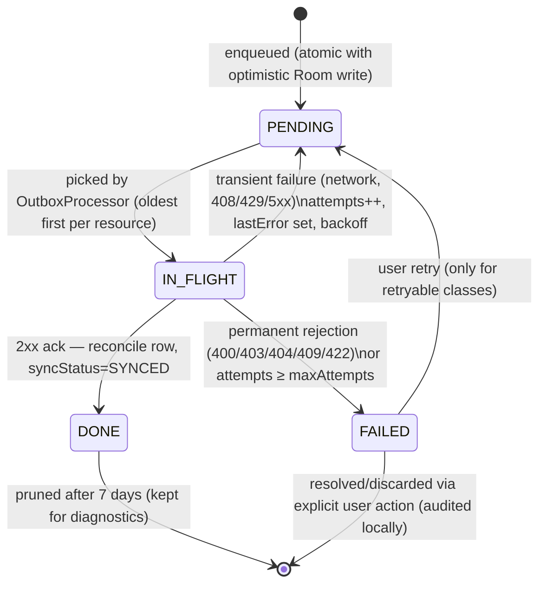

# WorkTrack — Offline-First Synchronization Strategy

Version: 1.0 · Status: Approved · Derives from: `00-master-spec.md` (§3, §4.5, §5, §6.3) · Companions: `05-android-architecture.md`, `07-security-architecture.md`

**Purpose.** This document specifies the Android synchronization subsystem end to end: the outbox pattern that makes Room the local source of truth for mutations, the ULID-keyed idempotent push protocol, the cursor-based delta pull, per-resource conflict resolution, WorkManager scheduling under Doze, and the failure-handling and observability contract that guarantees rejected work is surfaced to the user — never silently lost. It is the binding contract for `core:sync` and the server's `/sync` endpoints; both sides must evolve together.

---

## 1. Goals and constraints

| # | Goal / constraint | Consequence in design |
|---|---|---|
| G1 | **Multi-day offline** operation (field workforces: sites without coverage for shifts or whole rotations) | All reads from Room; outbox durable across process death and reboots; no TTL on queued mutations; cursors resume, never restart |
| G2 | **100k-employee tenants** must not melt the client or the API | Client syncs only its own slice (self + role scope); pull is paginated + batched; push batches capped; server backpressure honored (§4.4) |
| G3 | **Server-authoritative money paths** (attendance validity, balances, payroll — master spec §3) | Client never resolves conflicts on these; push responses reconcile local rows; some resource types are pull-only (§6) |
| G4 | No duplicate side effects despite retries and replays | ULID `idempotencyKey` per op; server idempotency store returns the original result on replay (§4.2) |
| G5 | Causal ordering where it matters (punch IN before OUT; leave apply before cancel) | FIFO **per resource** drain order (§3.4) |
| G6 | No silent data loss (master spec §6.3.6) | Terminal failures become user-visible notifications with actions (§8); quarantine, never delete (§7) |
| G7 | Battery and data budget compatible with a device that punches twice a day | Periodic sync ≥ 15 min interval, batched, delta-only; expedited work reserved for user-initiated actions (§5) |
| G8 | Tenant isolation and RBAC hold on the sync path | `/sync/*` runs the full middleware chain; each pushed op is re-authorized individually (`07-security-architecture.md` §4.2) |

Non-goals: peer-to-peer sync, multi-device merge for one employee's drafts (last writer wins via server), and web offline (the admin SPA is online-only, doc 06 §1).

## 2. Component overview

```
UI ──event──▶ ViewModel ──▶ UseCase ─┬─▶ Repository (core:data)
                                     │      │  Room txn: upsert row (syncStatus=PENDING)
                                     │      │            + insert OutboxEntry
                                     │      └─▶ SyncRequester.requestExpedited()
Room (source of truth) ◀── reconcile ──┐
                                       │
core:sync  SyncWorker ── drain outbox ─┴─▶ POST /sync/push
           (WorkManager)  then delta ────▶ GET  /sync/pull?types&cursor
```

`core:sync` owns: `SyncWorker` (single entry point), `OutboxProcessor` (push), `DeltaPuller` (pull), `SyncScheduler` (WorkManager wiring), `SyncHealthTracker` (telemetry). Repositories in `core:data` own enqueueing; features never touch the outbox directly (doc 05 §2).

### 2.1 Room schema (sync tables)

```sql
CREATE TABLE outbox_entry (
  id             TEXT PRIMARY KEY,            -- ULID
  op_type        TEXT NOT NULL,               -- CREATE|UPDATE|DECIDE|CANCEL|READ_RECEIPT
  resource_type  TEXT NOT NULL,
  resource_id    TEXT NOT NULL,
  payload_json   TEXT NOT NULL,
  idempotency_key TEXT NOT NULL UNIQUE,
  attempts       INTEGER NOT NULL DEFAULT 0,
  crash_count    INTEGER NOT NULL DEFAULT 0,  -- poison detection (§7)
  last_error     TEXT,
  before_json    TEXT,                        -- rollback snapshot for UPDATE ops (§7)
  state          TEXT NOT NULL DEFAULT 'PENDING',  -- PENDING|IN_FLIGHT|DONE|FAILED
  queued_at      INTEGER NOT NULL
);
CREATE INDEX idx_outbox_drain ON outbox_entry(state, resource_id, queued_at, id); -- FIFO-per-resource pick
CREATE INDEX idx_outbox_resource ON outbox_entry(resource_type, resource_id);

CREATE TABLE sync_cursor (
  resource_type  TEXT PRIMARY KEY,
  cursor         TEXT NOT NULL,               -- opaque server token (§4.3)
  last_synced_at INTEGER NOT NULL
);
```

Punch round trip (happy path):

```mermaid
sequenceDiagram
    participant UI as Punch Screen
    participant VM as ViewModel/UseCase
    participant R as Room
    participant W as SyncWorker
    participant API as POST /sync/push

    UI->>VM: onEvent(ConfirmPunch)
    VM->>R: txn: insert AttendancePunch(syncStatus=PENDING) + OutboxEntry(PENDING)
    R-->>UI: Flow emits — chip "Recorded, will verify"
    VM->>W: SyncRequester.requestExpedited()
    W->>R: pick oldest PENDING per resource → IN_FLIGHT
    W->>API: batch {idempotencyKey, op, payload+integrityToken}
    API-->>W: results[APPLIED {serverValidated:true, updatedAt}]
    W->>R: txn: entry→DONE; punch row ← server fields, syncStatus=SYNCED
    R-->>UI: Flow emits — chip "Verified"
    W->>API: GET /sync/pull?types=…&cursor
    API-->>W: changes + next cursor
    W->>R: txn: apply page + advance SyncCursor
```

## 3. Outbox pattern (push side)

### 3.1 Enqueue contract

Every offline-capable mutation is one **atomic Room transaction**:

1. Upsert the domain row optimistically with `syncStatus = PENDING` (for creates, the client generates the entity's ULID id — offline-generatable and sortable, master spec §4).
2. Insert an `OutboxEntry` (master spec §4.5): `id` (ULID), `opType` (`CREATE|UPDATE|DECIDE|CANCEL|READ_RECEIPT`…), `resourceType`, `resourceId`, `payloadJson` (the API request body), `idempotencyKey` (fresh ULID, minted once at enqueue and never regenerated), `attempts = 0`, `state = PENDING`, `queuedAt`.

Because both writes commit together, a crash can never produce a visible optimistic row without its outbox entry or vice versa (doc 05 §5.5). Punches additionally have **no** UPDATE/DELETE opTypes at all — append-only end to end (master spec §6.3.5).

### 3.2 Lifecycle state machine



Retry policy:

| Failure class | Examples | Transition | Policy |
|---|---|---|---|
| Transient | offline, timeout, 408, 429, 500–504 | → PENDING | Retry with WorkManager exponential backoff (§5); `attempts` unbounded for connectivity, bounded at `maxAttempts = 10` for server 5xx |
| Permanent — business rejection | 422 (stale balance, policy violation), 409 (already decided), 403 | → FAILED (terminal) | Never auto-retried; reconcile per conflict matrix (§6) + notify (§8) |
| Permanent — malformed | 400 schema errors | → FAILED (quarantine, §7) | Client bug; telemetry alert |
| Crash recovery | app killed while IN_FLIGHT | IN_FLIGHT → PENDING at worker start | Safe because replay with the same `idempotencyKey` is a no-op server-side |

### 3.3 Idempotency keys

- One ULID `idempotencyKey` per logical operation, minted at enqueue, immutable across all retries of that entry — this is what makes at-least-once delivery safe (G4).
- Sent per-op inside the push batch (and as the `Idempotency-Key` header for direct non-sync POSTs, master spec §5).
- Server keeps an idempotency store keyed `(cid, idempotencyKey)` with the canonical response, retained ≥ 30 days ≥ any realistic offline window; replays return the stored outcome without re-executing side effects.

### 3.4 Ordering — FIFO per resource

- Drain order: entries grouped by `resourceId`, groups processed oldest-first (`queuedAt`, tie-break `id` — ULIDs are time-sortable), **strictly sequential within a group**: entry N+1 for a resource is not sent until N reaches DONE or FAILED.
- A FAILED head entry **blocks its own resource's queue** (dependent ops would be nonsense — e.g. cancel of a leave request whose create was rejected); the blocked entries fail fast with `lastError = "blocked by <id>"` and reconcile together (§8).
- Across different resources there is no ordering guarantee, which permits batching (§4.1) and prevents one poisoned resource from stalling the world. Punch IN/OUT pairs share `resourceType=punch` but are distinct append-only resources; their causal order is preserved because the batch preserves enqueue order within a push and the server orders by `punchedAt` (client timestamp) anyway — `AttendanceDay` computation is order-insensitive by design.

## 4. Wire protocol

Derived from master spec §5 (`POST /sync/push`, `GET /sync/pull?types&cursor`; envelope `{ data, meta }`; RFC 7807 errors; bearer auth).

### 4.1 `POST /sync/push`

Request — up to **50 ops** per batch, enqueue order preserved:

```json
{
  "deviceId": "01J8…DEV",
  "ops": [
    {
      "idempotencyKey": "01J9AB…",
      "opType": "CREATE",
      "resourceType": "punch",
      "resourceId": "01J9AA…",
      "payload": { "type": "IN", "method": "GPS", "punchedAt": "2026-07-17T08:58:12Z",
                   "lat": 52.52, "lng": 13.40, "accuracyM": 12, "insideFence": true,
                   "geofenceId": "01J8…GF", "isMock": false, "integrityToken": "…" }
    }
  ]
}
```

Response — **per-op results** (the batch itself is not transactional):

```json
{
  "data": { "results": [
    { "idempotencyKey": "01J9AB…", "status": "APPLIED", "resource": { "id": "01J9AA…", "serverValidated": true, "updatedAt": "…" } },
    { "idempotencyKey": "01J9AC…", "status": "REJECTED",
      "problem": { "type": "https://api.worktrack.app/problems/stale-leave-balance",
                   "title": "Insufficient leave balance", "detail": "Requested 3.0 days, available 1.5" } },
    { "idempotencyKey": "01J9AD…", "status": "DUPLICATE", "resource": { "…": "…" } }
  ] },
  "meta": { "throttle": null }
}
```

- `APPLIED` → entry DONE; response `resource` fields overwrite the local row (**server fields win**, master spec §6.3.4), `syncStatus = SYNCED`.
- `DUPLICATE` (idempotency replay) → treated exactly as APPLIED.
- `REJECTED` → entry FAILED with the problem stored in `lastError`; reconciliation per §6.
- Each op is individually re-authorized against the §4.2 permission catalog and tenant scope (`07-security-architecture.md`); a whole-batch 401/403 occurs only for token-level failures.

### 4.2 Server-side apply semantics

Per op: idempotency-store hit → return stored result; else validate (schema → RBAC/scope → business rules) → apply in a Firestore transaction stamping server `updatedAt` → write audit where applicable → store result. Server `updatedAt` is authoritative and monotonic per resource — it is the pull cursor's basis.

### 4.3 `GET /sync/pull`

- Request: `GET /sync/pull?types=punch,attendanceDay,leaveRequest,leaveBalance&cursor=<opaque>&limit=500`.
- The cursor is **opaque to the client** but canonically encodes, per resource type, the pair `(updatedAt, id)` of the last delivered document; server orders by `(updatedAt ASC, id ASC)` — the ULID `id` tie-breaker makes pagination stable when many rows share an `updatedAt` (bulk server jobs like accruals or `AttendanceDay` recomputation produce exactly this).
- Response:

```json
{
  "data": {
    "changes": [
      { "resourceType": "leaveBalance", "op": "UPSERT", "resource": { "id": "…", "usedDays": 4.5, "version": 7, "updatedAt": "…" } },
      { "resourceType": "leaveRequest", "op": "DELETE", "id": "01J9…", "deletedAt": "…" }
    ],
    "hasMore": true
  },
  "meta": { "cursor": "eyJwdW5jaCI6…" }
}
```

- Deletes travel as soft-delete tombstones (`deletedAt`, master spec §4); client hard-deletes local rows after applying, tombstones retained server-side ≥ 90 days so a device offline longer re-bootstraps (§4.5).
- Apply is a single Room transaction per page: upserts overwrite local rows **except** rows with `syncStatus = PENDING` (a not-yet-pushed local change is never clobbered by a pull; the subsequent push resolves it per §6). `SyncCursor(resourceType, cursor, lastSyncedAt)` is updated in the same transaction — a crash between apply and cursor save re-applies an idempotent page, never skips one.
- Scope: the server narrows pulled data exactly as reads are narrowed (self slice for EMPLOYEE; branch slice for scoped managers) — a 100k-employee tenant sends an employee only their own few hundred rows (G2).

### 4.4 Batching and backpressure

- Push: ≤ 50 ops/batch, loop until outbox drained or budget exhausted; Pull: `limit ≤ 500`, loop while `hasMore` within the same budget (worker time budget 9 min, well under WorkManager's 10-min cap).
- Server backpressure: 429 with `Retry-After`, or in-band `meta.throttle = { retryAfterSeconds }` on partial service; client defers remaining work to the next scheduled run honoring the hint. Per-device push rate is additionally capped server-side (T12, `07-security-architecture.md` §2).
- Payload hygiene: gzip request/response; pulls exclude heavy blobs (payslip PDFs, attachments are URL references fetched on demand).

### 4.5 Bootstrap vs incremental

| Mode | Trigger | Behavior |
|---|---|---|
| **Bootstrap** | First login on a device; cursor reset (tombstone horizon exceeded, schema epoch bump, tenant migration) | Ordered full pull of reference data first (company, branches, shifts, leaveTypes, leavePolicies, holidayCalendars, geofences), then self slice (employee, balances, recent `attendanceDay` 90 d, punches 30 d, leaveRequests 12 mo, payslips 24 mo), then role-scoped extras (approvals). Runs as expedited work with a blocking first-run screen only until reference data + today's slice land; the rest streams in background |
| **Incremental** | Every subsequent sync | Push outbox, then pull deltas per cursor; typical payload < a few KB |

The server signals cursor invalidity with 410 `type: cursor-expired` → client clears that resource type's cursor and re-bootstraps **that type only**.

## 5. Scheduling (WorkManager)

| Work | Type | Constraints | Policy |
|---|---|---|---|
| `sync-periodic` | Unique `PeriodicWorkRequest`, 15 min (WorkManager minimum), `ExistingPeriodicWorkPolicy.UPDATE` | `NetworkType.CONNECTED` | Baseline drain + pull; batteryNotLow **not** set (punches must flow on low battery) |
| `sync-now` | Unique `OneTimeWorkRequest`, `setExpedited(RUN_AS_NON_EXPEDITED_WORK_REQUEST)` fallback, `ExistingWorkPolicy.APPEND_OR_REPLACE` | `CONNECTED` | Enqueued by `SyncRequester` on: any outbox enqueue, app foreground, connectivity regained (`NetworkCallback`), pull-to-refresh, FCM sync-nudge data message |
| Punch flush | Same `sync-now` expedited path; punch enqueue always requests expedited quota | `CONNECTED` | Punches are the latency-critical mutation; expedited work gives foreground-service-like priority without a persistent notification. If expedited quota is exhausted, falls back to ordinary one-time work — acceptable because the punch is already durably queued and optimistically visible (doc 05 §6) |
| Backoff | — | — | `BackoffPolicy.EXPONENTIAL`, initial 30 s, doubling, capped at 1 h (WorkManager `MAX_BACKOFF_MILLIS`); jitter inherent in WorkManager scheduling |

Both work items funnel into the same `SyncWorker` (unique-work mutual exclusion prevents concurrent drains; a run-lock row in Room is a second guard). The worker is idempotent and resumable at any interruption point (§3.2 crash recovery, §4.3 transactional cursor).

**Doze/battery**: no exemptions requested — the app never asks for `REQUEST_IGNORE_BATTERY_OPTIMIZATIONS` (Play policy + battery ethics). Doze defers periodic sync to maintenance windows; that is acceptable because (a) punches ride expedited work triggered by user interaction (device is awake by definition), (b) FCM high-priority data messages nudge sync for time-sensitive server events (approval decided), and (c) everything else tolerates deferral. Telemetry tracks `queuedAt → DONE` latency percentiles to verify this holds in the field (§8).

## 6. Conflict resolution matrix

Policy per resource type; "client wins" never applies to server-authoritative fields anywhere (G3).

| Resource type | Class | Client writes? | Conflict handling |
|---|---|---|---|
| `punch` (AttendancePunch) | **Append-only** | CREATE only | No conflicts possible by construction; duplicates collapsed by idempotency key; validity disputes are data (`serverValidated`, `invalidReason`), not conflicts |
| `attendanceDay` | **Server-authoritative projection** | Never | Pull-only; local row always overwritten (versioned via `version` field, stale pulls with lower `version` discarded) |
| `leaveBalance` | **Server-authoritative** | Never | Pull-only; `pendingDays` overlay for optimistic UI is display-time arithmetic, never persisted into the balance row (doc 05 §6) |
| `payslip` / `payslipLine` / `payrollRun` | **Server-authoritative** | Never | Pull-only, immutable once published |
| `leaveRequest` (create/cancel) | **Reject-and-notify** | CREATE, CANCEL | Server validates against current balance/policy at apply time; stale-balance or policy violation → `REJECTED` op result → local row flipped to `REJECTED` with server reason + notification (§8). Cancel racing an approval: 409 `already-decided` → local row takes the server's decided state, user notified |
| `regularizationRequest`, `shiftSwapRequest` | **Reject-and-notify** | CREATE, CANCEL | Same as leaveRequest |
| Approval decisions (`leave/…/decide`, `regularizations/…/decide`, `shift-swaps/…/decide`) | **First-writer-wins (server)** | DECIDE op | Second decision gets 409 → FAILED (terminal, not retried); local state re-pulled; deciding user informed "already decided by X" |
| `employee` profile self-service fields (phone, avatarUrl, emergency contact) | **Last-write-wins per field** | UPDATE (allowed fields only) | Server applies field-level LWW on `updatedAt`; pushed update returns merged row which overwrites local. Org-controlled fields (branch, position, salary linkage) are never client-writable — present in payload → 403 |
| `notificationMessage.readAt` | LWW (monotonic) | READ_RECEIPT | `readAt` only ever set, never cleared; max(readAt) wins trivially |
| Reference data (branches, shifts, geofences, leaveTypes, policies, holidays, announcements) | **Server-authoritative** | Never (admin console mutates via direct API) | Pull-only |
| `device` | Server-managed | Bind/revoke via direct API (online-only) | Not in the outbox at all |

Guard rails: a pull never overwrites a `syncStatus=PENDING` row (§4.3); after that row's push resolves (APPLIED or REJECTED), the next pull converges it to server truth. Room migrations preserve the outbox and cursors across app updates; a destructive-migration fallback is forbidden in release builds.

## 7. Failure handling

- **Poison messages**: an entry that repeatedly crashes the processor (serialization bug, impossible state) is detected by a per-entry crash counter (incremented pre-processing, cleared post); at 3 crashes the entry moves to FAILED with `lastError = POISON` and processing continues with the next resource group — one bad entry cannot wedge sync (G6, §3.4 blocking is per-resource only).
- **Max-attempt quarantine**: FAILED entries are quarantined, not deleted: retained with full payload + `lastError` for 30 days, visible in a debug-accessible "sync issues" screen (user-facing summary per §8, engineer-facing detail via support bundle). Quarantined entries are excluded from drains but included in telemetry.
- **Reconciliation of the optimistic row**: whenever an entry reaches FAILED, the repository reverses or re-labels the optimistic write in the same transaction that records the failure: creates → row marked `syncStatus=REJECTED` with reason (kept, visibly, for the user to act on — e.g. re-apply leave with valid dates; punches are never deleted, they carry `invalidReason`); updates → row restored from `beforeJson` snapshot held on the entry; decides → target re-pulled.
- **Cursor integrity**: pull apply + cursor advance are transactional (§4.3); a corrupted cursor (deserialization failure) resets that type to bootstrap rather than failing sync.
- **Auth failures**: 401 → single forced token refresh + retry; second 401 aborts the run and, if the token is revoked (`07-security-architecture.md` §3.4), triggers the sign-out flow; outbox is preserved for the same user's next session and wiped on a different user's login.
- **Clock skew**: client timestamps (`punchedAt`, `queuedAt`) are recorded with the device's elapsed-realtime anchor plus an NTP-checked offset when available; server records receive time and flags punches with skew > 5 min for the exceptions queue rather than rejecting.

## 8. Observability and UX surfacing

### 8.1 Telemetry (SyncHealthTracker)

Structured, PII-free events (ids + enums only, `07-security-architecture.md` §7.4): per run — duration, ops pushed/applied/rejected, pages pulled, rows applied, backoff state; per entry — `queuedAt → DONE/FAILED` latency; gauges — outbox depth, oldest-pending age, quarantine count, cursor age per resource type. Exported via the analytics pipeline with tenant-level dashboards and alerts: p95 punch sync latency > 10 min, quarantine rate > 0.1%, any poison event, cursor age > 48 h on active devices.

An in-app diagnostics surface (Profile → Settings → Sync status) shows: last successful sync, pending count, failed count with reasons — the first thing support asks for.

### 8.2 UX surfacing rules (no silent data loss)

| Situation | Surface |
|---|---|
| Op pending (offline or queued) | Per-row glyph ⟳ + global offline banner (doc 05 §6); no toast noise |
| Punch flagged by server (`serverValidated=false`) | Row badge + notification "Punch recorded but flagged: <reason>. HR can review." linking to attendance history detail |
| Leave/regularization/swap rejected | Local push notification (deep link `worktrack://leave/requests/{id}`) + row state REJECTED with server reason + inline "Apply again" action |
| Decision conflict (409) | Notification "Already decided by <approver>"; approvals inbox row resolves to final state |
| Entry quarantined (poison/malformed) | Non-technical notification "Some changes couldn't be saved — tap to review" → sync issues screen listing affected items with retry/discard; discard requires explicit confirmation and is the **only** path that abandons user data |
| Sync degraded (backpressure, repeated 5xx) | Passive banner "Sync delayed — will keep retrying"; no user action solicited |

Invariant: every terminal FAILED entry produces exactly one user-visible artifact (notification and/or persistent row state). This is asserted in the `core:sync` end-to-end test suite (doc 05 §8: rejection scenarios must observe a notification emission), making G6/master-spec §6.3.6 a tested property, not an aspiration.

## 9. Verification matrix

Executable acceptance criteria for `core:sync` (tooling per doc 05 §8: JVM tests, in-memory Room, MockWebServer fake server; WorkManager via `WorkManagerTestInitHelper`):

| # | Property | Scenario asserted |
|---|---|---|
| V1 | Atomic enqueue | Kill (throw) between row upsert and outbox insert → transaction rolls back; neither is visible |
| V2 | Idempotent replay | Same batch delivered twice (network retry after response loss) → server fake returns DUPLICATE; exactly one local row, one DONE entry |
| V3 | FIFO per resource | Leave create then cancel enqueued offline → cancel never sent before create acked; create REJECTED → cancel fails fast as blocked |
| V4 | Crash mid-flight | Process death with entry IN_FLIGHT → next run resets to PENDING, resends same idempotencyKey, converges to one server record |
| V5 | Pull never clobbers pending | Local PENDING profile edit + pull carrying older server row → local row untouched; after push, next pull converges |
| V6 | Cursor transactionality | Crash between page apply and cursor save → page re-applied idempotently; no gap, no duplicate rows |
| V7 | Cursor expiry | 410 cursor-expired on one type → that type re-bootstraps; other cursors untouched |
| V8 | Rejection surfaces | 422 stale-balance on leave create → row REJECTED with reason, notification emitted exactly once (G6 invariant) |
| V9 | 409 decision race | Decide op returns 409 → entry FAILED terminal (no retry), target re-pulled to decided state, info surfaced |
| V10 | Backoff and backpressure | 500,500,200 sequence → exponential gaps honored; 429 with Retry-After defers remaining batches |
| V11 | Poison isolation | Entry that throws in serialization 3× → quarantined FAILED(POISON); other resources continue draining same run |
| V12 | Offline burst | 200 queued punches over 3 simulated days → drained in ≤ 4 batches, order preserved per resource, all SYNCED |
| V13 | Auth revocation | 401 twice → run aborts, outbox preserved; different-user login wipes outbox and cursors |
| V14 | Migration safety | Room schema bump with pending outbox entries → entries and cursors survive migration (MigrationTestHelper) |

Server-side mirrors (functions test suite): idempotency-store replay returns byte-identical results; per-op RBAC re-check rejects an op whose permission was revoked after enqueue; tombstone horizon and 410 emission; `updatedAt` monotonicity under concurrent transactions. A release of either side must pass both suites against the shared contract fixtures (JSON golden files for §4 payloads, versioned with `/v1`).
