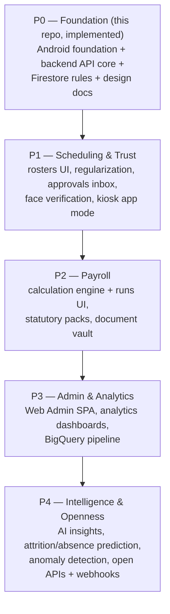
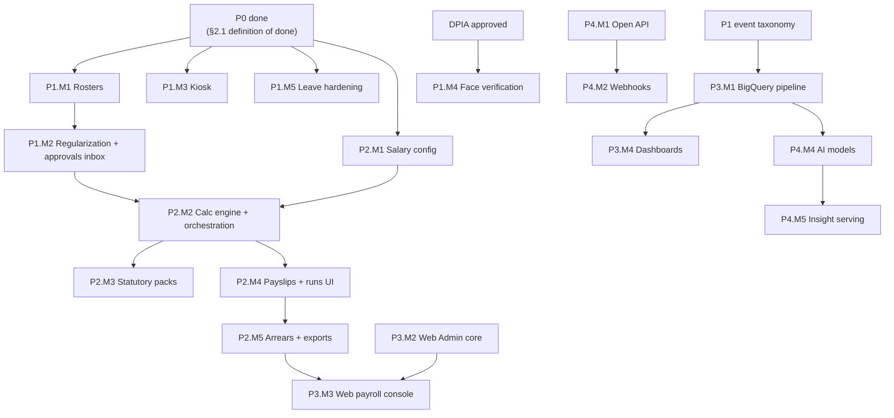

# WorkTrack — Development Roadmap

Version: 1.0 · Status: Approved · Owners: Platform Architecture + Product · Derives from: `00-master-spec.md` §8

**Purpose.** This document expands the master specification's delivery phases (P0–P4) into an executable milestone plan: per-phase workstreams (Android, Backend, Web, Data/AI, Security/Compliance), concrete deliverables, exit criteria, dependency ordering, a suggested team shape, and the program risk register. It also fixes the P0 definition of done to exactly what `00-master-spec.md` §8 declares implemented in this repository. Phase numbering here is delivery-phase numbering (P0–P4) and must not be confused with requirement priorities (P0/P1/P2) in `01-product-requirements.md`.

---

## 1. Phase overview and dependency ordering

Hard dependencies that fix this ordering:

| Dependency | Reason |
|---|---|
| P1 before P2 | Payroll consumes AttendanceDay projections that are only trustworthy once regularization and roster-driven shift assignment exist (worked/late/OT minutes must be correctable and shift-aware). |
| P2 before P3 payroll dashboards | Analytics over payroll requires PayrollRun/Payslip data to exist. |
| BigQuery pipeline (P3) before AI (P4) | Model training and `/analytics/insights` features read the warehouse, not Firestore. |
| Approvals inbox (P1) before payroll approval UX (P2) | Reuses the same role-gated approvals surface on Android. |
| Kiosk mode (P1) independent of payroll | Can ship in parallel inside P1; depends only on P0 punch validation + `KIOSK` role. |
| Web Admin (P3) after API hardening (P0–P2) | The SPA consumes the same `/v1` API; shipping it against a churning payroll API would force rework. Design (`06-web-admin-design.md`) proceeds earlier; implementation is P3. |

Soft parallelism: Security/Compliance and Data/AI workstreams run continuously; each phase below lists their concurrent obligations.

### 1.1 Workstream map across phases

| Workstream | P0 (done) | P1 | P2 | P3 | P4 |
|---|---|---|---|---|---|
| Android | Foundation: modules, features, offline sync | Rosters, regularization, approvals inbox, face, kiosk mode | Payroll runs UI, document vault | Directory/announcement polish | Insight surfaces |
| Backend | API core: middleware, punch, leave, sync, payslip read | Rosters/swaps/regularization/kiosk/face/accruals/holidays | Payroll engine, statutory packs, exports | Analytics API, DSR, residency | Open API, webhooks, SSO/SCIM |
| Web | — | Design finalization only | Scaffolding (late) | **Web Admin SPA + dashboards** | Insights + platform consoles |
| Data/AI | — | Event taxonomy → staging BQ | Payroll events, reconciliation | **BigQuery pipeline prod**, KPI layer | Models, anomaly detection, serving |
| Security/Compliance | Rules, middleware, token model | Integrity blocking, DPIA, kiosk secrets | SoD, retention, statutory change control | SOC 2 Type I, pen test, DSR runbook | AI governance, SOC 2 Type II |

---

## 2. P0 — Foundation (this repo, implemented)

### 2.1 P0 definition of done

P0 is done exactly when the following — the master spec §8 P0 scope, verbatim in substance — is implemented and verifiable in this repository:

1. **Android build foundation**: `build-logic/` convention plugins — `worktrack.android.application`, `worktrack.android.library`, `worktrack.android.library.compose`, `worktrack.android.feature`, `worktrack.android.hilt`, `worktrack.android.room`.
2. **Core modules**: `core:common`, `core:model`, `core:database`, `core:network`, `core:datastore`, `core:domain`, `core:data`, `core:sync`, `core:designsystem` — wired per the module graph in master spec §6.1 (features depend on domain/designsystem/common; data composes database/network/datastore; sync owns workers, outbox processor, scheduling).
3. **Feature modules**: `feature:auth` (Login → ForgotPassword → DeviceBinding), `feature:dashboard`, `feature:attendance`, `feature:leave`, `feature:payslips`, `feature:profile` — navigable per master spec §6.2 (AuthGraph → MainGraph, bottom bar Dashboard/Attendance/Leave/Profile, deep links `worktrack://leave/requests/{id}`, `worktrack://payslips/{id}`, `worktrack://approvals`).
4. **Offline & sync contract**: Room as local source of truth (Flow DAOs), optimistic writes with `syncStatus=PENDING`, OutboxEntry with ULID `idempotencyKey`, `SyncWorker` (network-constrained, exponential backoff, unique work) draining FIFO-per-resource then delta-pulling per SyncCursor; punches append-only; server-authoritative conflict policy with actionable rejection notifications.
5. **Backend API core** (Cloud Functions, Node 20, TypeScript, Express, `/v1`): auth/tenant/RBAC middleware chain (verify token → tenant context from claims `{cid,r,b,eid}` → permission check → handler, deny-by-default); attendance punch endpoint with validation (geofence, device binding, `serverValidated`/`invalidReason`); leave requests + decisions (approval chain, balance movements); sync push/pull (batched idempotent ops, delta cursors); payslip read endpoints.
6. **Firestore security rules**: no direct client access to server-authoritative collections; rules as second line of defense behind the API.
7. **Full design docs**: `00`–`09` document set present and mutually consistent, with `00-master-spec.md` canonical.

Exit is binary: each of the seven items above either exists in-repo and passes its checks or P0 is not done. No partial credit; no other feature counts toward P0.

### 2.2 P0 verification checklist

| Check | Method |
|---|---|
| Module graph matches spec §6.1 | Gradle project structure + dependency assertions in convention plugins |
| Offline punch → sync exactly-once | Instrumented test: airplane mode punch, reconnect, assert single server record |
| Middleware chain deny-by-default | API tests: missing token 401, wrong tenant 403, missing permission 403 |
| Idempotent sync push | Replay same batch, assert no duplicate effects |
| Firestore rules deny client writes | Rules-emulator test suite over server-authoritative collections |
| Docs consistency | Cross-reference review: entities/roles/paths in 01/02/09 vs 00 |

---

## 3. P1 — Scheduling & Trust

Theme: make attendance data correct and correctable at branch scale; extend capture surfaces.

| Workstream | Deliverables | Notes |
|---|---|---|
| Android | Roster views (my schedule, team roster for `TEAM_LEAD`/`BRANCH_MANAGER`); regularization request flow; **approvals inbox** (role-gated: leave, regularization, shift swaps); face-verification punch capture; **kiosk app mode** (rotating TOTP QR display for `KIOSK` devices) | Approvals inbox destination already navigable in P0 shell (`worktrack://approvals`) |
| Backend | `GET/PUT /rosters` + ShiftAssignment write paths; rotation generation jobs (Cloud Scheduler → batched Cloud Tasks); roster locks; `POST /attendance/regularizations` + `/decide` with AttendanceDay recompute; `POST /shift-swaps` + `/decide`; kiosk token issuance/verification (HMAC, 30 s window, branch cross-check); face-embedding pipeline (Cloud Storage, raw-capture deletion, server-tunable threshold); leave accrual scheduler; holiday calendars |
| Web | `06-web-admin-design.md` finalized against real P1 APIs (design only; no SPA build) |
| Data/AI | Pub/Sub event taxonomy frozen (`punch.recorded`, `leave.decided`, `roster.changed`); events flowing to a staging BigQuery dataset | De-risks P3 pipeline |
| Security/Compliance | Play Integrity enforcement on punch endpoints moves from log-only to blocking; speed-of-travel plausibility checks live; kiosk secret provisioning/rotation runbook; face-data DPIA completed |

**Milestones.**

| ID | Milestone | Entry depends on | Verified by |
|---|---|---|---|
| P1.M1 | Rosters end-to-end (`GET/PUT /rosters`, roster views, rotation generation jobs, locks) | P0 done | 100k-slice generation load test; lock-override audit test |
| P1.M2 | Regularization loop (request → chain decide → AttendanceDay recompute) + approvals inbox | P1.M1 (shift-aware days) | Recompute ≤ 60 s after approval; chain-permission tests |
| P1.M3 | Kiosk mode (TOTP QR issuance/display/verification, secret provisioning) | P0 punch validation | Replay/expiry/branch-mismatch rejection tests; offline-kiosk drill |
| P1.M4 | Face verification (embedding pipeline, threshold, capture UX) | DPIA approved | FAR/FRR measured on eval set incl. demographic slices |
| P1.M5 | Leave hardening (accrual scheduler, holiday calendars, optional-holiday elections) | P0 leave core | Accrual idempotency re-run test; holiday-aware day math tests |

**Exit criteria.** A 500-employee, 3-branch pilot tenant runs 4 consecutive weeks where: rosters generate ahead ≥ 28 days with zero manual DB fixes; ≥ 95% of invalid/missed punches are resolved via regularization in-app; kiosk check-in round-trip (scan → server-validated) p95 ≤ 5 s; face match false-accept rate ≤ 0.1% at configured threshold on the eval set; approvals inbox drives all three request types end-to-end; zero P0-regression on the sync contract (regression suite green).

## 4. P2 — Payroll

Theme: money. Highest-correctness phase; ships behind per-tenant enablement.

| Workstream | Deliverables | Notes |
|---|---|---|
| Android | Payroll runs UI for `PAYROLL_ADMIN`/`COMPANY_ADMIN` (run lifecycle DRAFT→CALCULATING→REVIEW→APPROVED→PAID→CLOSED, exception queue review); payslip detail upgrades (PayslipLine breakdown, PDF); document vault (EmployeeDocument upload/view, expiry reminders) | Runs UI on Android per spec §8; full desktop ergonomics arrive with P3 Web Admin |
| Backend | Calculation engine: SalaryComponent evaluation (FIXED/PERCENT_OF_BASIC/PERCENT_OF_GROSS/FORMULA), SalaryStructure/EmployeeSalary effective-dating; run orchestration via per-tenant Cloud Tasks queues (250-employee batches, quarantine on per-employee failure); AttendanceDay/LeaveRequest period integration (workedDays, paidLeaveDays, lopDays, overtimeMinutes); arrears routing for post-lock regularizations; **statutory packs** v1 (versioned, `statutoryCode` binding, launch jurisdictions); payslip PDF rendering to Cloud Storage; approval + segregation-of-duties; payment register / GL exports |
| Web | — (design refinements only) |
| Data/AI | Payroll events into staging BigQuery; reconciliation notebook (run totals vs warehouse) used as release gate |
| Security/Compliance | SoD enforcement tests; payroll audit-trail review (every state transition audit-logged with `totalsJson` snapshot); 7-year retention plumbing for payroll-affecting AuditLog; statutory pack change-control process |

**Milestones.**

| ID | Milestone | Entry depends on | Verified by |
|---|---|---|---|
| P2.M1 | Salary configuration (components, structures, EmployeeSalary effective-dating) | P0 done | Overlap-rejection and formula-validation tests |
| P2.M2 | Calculation engine + run orchestration (Cloud Tasks batches, quarantine, progress) | P2.M1, P1.M2 (trustworthy AttendanceDay) | 100k synthetic run ≤ 30 min with forced retries/restarts |
| P2.M3 | Statutory packs v1 (versioned, launch jurisdictions) | P2.M2 | External reviewer sign-off per jurisdiction |
| P2.M4 | Payslips + PDFs + runs UI (lifecycle, exception queue, SoD approve) | P2.M2 | Immutability of CLOSED runs under test; SoD self-approve blocked |
| P2.M5 | Arrears + exports (post-lock corrections → next run; payment register, GL) | P2.M4 | Arrears traceability test; export totals = `totalsJson` |
| P2.M6 | Document vault (upload, expiry reminders, signed URLs) | independent within P2 | Access audit-logged; T-30/T-7 reminder tests |

**Exit criteria.** Parallel-run gate: for 2 pilot tenants, 2 consecutive months of WorkTrack payroll match the incumbent system to the cent for ≥ 99.5% of payslips, with every mismatch explained and dispositioned. 100k-employee synthetic tenant completes a run ≤ 30 min with zero lost/duplicated payslips across forced task retries and function restarts. CLOSED runs immutable under test. Statutory outputs validated by an external reviewer per launch jurisdiction.

## 5. P3 — Admin & Analytics

Theme: desk personas and decision support.

| Workstream | Deliverables | Notes |
|---|---|---|
| Android | Directory + announcements polish; analytics deep-link handoffs | Light phase for Android |
| Backend | `/analytics/kpis` served from BigQuery; DSR endpoints (export/erasure with pseudonymization); data-residency provisioning (region pinned at tenant creation); org directory search index |
| Web | **Web Admin SPA** (React 18 + TS, Firebase Hosting) implementing `06-web-admin-design.md`: org management, employee lifecycle, policy configuration (leave/shift/holiday), rosters, approvals, payroll console, audit-log explorer, **analytics dashboards**; WCAG 2.1 AA gate (axe-core CI) | Consumes the identical `/v1` API — no privileged endpoints |
| Data/AI | **BigQuery pipeline** production-grade: Firestore export + streaming events, tenant-partitioned datasets, freshness SLO ≤ 24 h (streamed ≤ 5 min); KPI semantic layer; per-tenant cost-attribution tables |
| Security/Compliance | SOC 2 Type I audit readiness (controls per `07-security-architecture.md`); GDPR DSR runbook live; pen test of Web Admin + API |

**Milestones.**

| ID | Milestone | Entry depends on | Verified by |
|---|---|---|---|
| P3.M1 | BigQuery pipeline production (export + streaming, partitioned datasets, freshness SLO) | P1 event taxonomy | Freshness monitors ≤ 24 h / ≤ 5 min streamed; reconciliation vs Firestore |
| P3.M2 | Web Admin core (auth, org, employees, policies, rosters, approvals) | API stable through P2 | Task-parity list for `COMPANY_ADMIN`/`HR_ADMIN` |
| P3.M3 | Web Admin payroll console + audit-log explorer | P3.M2, P2 complete | `PAYROLL_ADMIN`/`AUDITOR` task parity; SoD honored in UI |
| P3.M4 | Analytics dashboards + `/analytics/kpis` on BigQuery | P3.M1 | p95 ≤ 3 s per panel at 100k; zero Firestore scans |
| P3.M5 | Compliance surface (DSR endpoints, data residency provisioning) | independent within P3 | DSR export ≤ 72 h automated; region-pinning verified incl. backups |

**Exit criteria.** Web Admin reaches task-parity for `COMPANY_ADMIN`/`HR_ADMIN`/`PAYROLL_ADMIN`/`AUDITOR` daily jobs (defined task list, 100% completable without Android or support intervention); dashboards serve a 100k-employee tenant with p95 ≤ 3 s per KPI panel and zero Firestore collection scans; DSR export ≤ 72 h automated; axe-core zero critical violations; SOC 2 Type I report issued or scheduled with zero open high findings.

## 6. P4 — Intelligence & Openness

Theme: differentiation on top of a trusted data asset.

| Workstream | Deliverables | Notes |
|---|---|---|
| Android | Insight surfaces (manager nudges: absenteeism risk, OT anomaly) with explanation + confidence UI | Advisory-only presentation |
| Backend | **Open API** program: published OpenAPI spec, scoped API keys (reusing `resource:action` permissions), partner rate tiers; **webhooks** (HMAC-signed, ≥ 3 retries + DLQ, secret rotation); SSO (OIDC/SAML) + SCIM provisioning |
| Web | Insights dashboards; webhook/API-key management console; insight feedback capture (accept/dismiss) for model improvement |
| Data/AI | **AI insights**: absenteeism-risk and attrition-signal models, overtime/punch **anomaly detection**; feature pipelines in BigQuery; per-tenant opt-out; model cards + monitoring (drift, calibration); `GET /analytics/insights` serving layer |
| Security/Compliance | AI governance: human-review requirement (no automated adverse action), bias evaluation across branches/departments, DPIA for profiling; webhook/API-key abuse monitoring; SOC 2 Type II period underway |

**Milestones.**

| ID | Milestone | Entry depends on | Verified by |
|---|---|---|---|
| P4.M1 | Open API program (OpenAPI spec, scoped API keys, partner rate tiers) | P0–P3 API stability | External team builds an integration from docs alone |
| P4.M2 | Webhooks (HMAC signing, retries + DLQ, secret rotation, console) | P4.M1 | Delivery ≥ 99.5% within 5 min; replay-from-DLQ drill |
| P4.M3 | SSO (OIDC/SAML) + SCIM | independent within P4 | Certification against two major IdPs; deprovision ≤ 5 min |
| P4.M4 | AI feature pipelines + models (absenteeism, attrition, OT/punch anomaly) | P3.M1 warehouse | Held-out AUC ≥ 0.75 vs baseline; bias evaluation passed |
| P4.M5 | Insight serving + surfaces (`GET /analytics/insights`, manager UI, feedback loop) | P4.M4 | 100% explanation coverage; opt-out honored; no automated adverse action |

**Exit criteria.** Insights beat naive baselines on held-out data (e.g. absenteeism risk AUC ≥ 0.75 vs seasonal baseline) and are live for opt-in tenants with explanation coverage of 100% of surfaced insights; webhook delivery success ≥ 99.5% within 5 min (excluding endpoint-down); at least 2 external integrations built on the open API by a non-WorkTrack team using published docs alone; SSO/SCIM certified against two major IdPs.

---

## 7. Cross-phase milestone dependencies

The critical path is P0 → P1.M1 → P1.M2 → P2.M2 → P2.M4 → P2.M5 → P3.M3: everything payroll-trustworthy depends on shift-aware, correctable attendance. Kiosk (P1.M3), face (P1.M4), document vault (P2.M6), the BigQuery pipeline (P3.M1), and SSO/SCIM (P4.M3) are off-critical-path and absorb schedule slack.

## 8. Tenant rollout playbook (per phase)

| Stage | Scope | Gate to next stage |
|---|---|---|
| Internal dogfood | WorkTrack's own tenant on staging-parity prod config | Feature-complete, exit-criteria suites green |
| Design partners | 2–3 tenants, feature-flagged, weekly feedback loop | 4 weeks stable; pilot metrics met (phase exit criteria) |
| Early access | Opt-in tenants, self-serve enablement | Support load ≤ 5 tickets/1k employees/month; SLOs held |
| General availability | Flag default-on for new tenants; migration comms for existing | Phase gate review recorded (§12) |

Payroll (P2) adds a mandatory parallel-run stage between design partners and early access for every tenant, regardless of size: one full cycle matched against the incumbent before WorkTrack becomes the paying system.

## 9. Team shape suggestion

| Role | P0–P1 | P2 | P3 | P4 | Notes |
|---|---|---|---|---|---|
| Android engineers | 3 | 2 | 1 | 2 | Peak early: foundation, sync, kiosk, approvals |
| Backend (TS) engineers | 3 | 4 | 3 | 3 | Peak in P2: payroll engine + statutory packs |
| Web engineers | 0 | 1 (prep) | 3 | 2 | SPA is P3; one engineer starts scaffolding late P2 |
| Data engineer | 0.5 | 1 | 2 | 2 | Event taxonomy from P1; pipeline in P3 |
| ML engineer | 0 | 0 | 0.5 | 2 | Joins late P3 for feature pipelines |
| QA / SDET | 1 | 2 | 2 | 2 | Payroll parallel-run automation is a dedicated effort |
| Security engineer | 0.5 | 1 | 1 | 1 | Shared → dedicated from P2 (SoD, SOC 2, pen test) |
| Product manager | 1 | 1 | 1.5 | 1.5 | Second PM (part-time) for Web Admin + platform/API |
| Engineering manager / TL | 1 | 1 | 1.5 | 1.5 | |
| **Total (approx.)** | **10** | **13** | **15.5** | **17** | |

Structure: one durable **platform pod** (API core, sync, infra, security) and per-phase **feature pods** (scheduling, payroll, web/analytics, AI). Statutory pack authoring pairs backend engineers with contracted per-jurisdiction payroll domain experts — do not staff this as pure engineering.

## 10. Risk register (top 10)

| # | Risk | Likelihood | Impact | Mitigation | Owner |
|---|---|---|---|---|---|
| R1 | Payroll miscalculation damages trust irreparably | Medium | Critical | P2 parallel-run gate (2 months, ≥ 99.5% match-to-the-cent); per-employee quarantine instead of silent failure; immutable CLOSED runs; statutory pack versioning + external review | Backend lead |
| R2 | Firestore hot-spots / cost blowout at 100k-employee tenants | Medium | High | Sharded counters, projection reads, BigQuery offload, per-tenant cost attribution with alerts (arch doc §6); 100k synthetic-tenant load test as a standing release gate from P1 | Platform pod |
| R3 | Punch spoofing (mock GPS, rooted devices, replayed kiosk QR) undermines the core product claim | High | High | Device binding + Play Integrity blocking from P1; TOTP window + HMAC + branch cross-check; speed-of-travel checks; monitored spoof-attempt metrics; bug-bounty scope | Security eng |
| R4 | Sync-contract bugs cause silent data loss in the field | Medium | Critical | Append-only punches; idempotency ledger; per-item push results; "no silent loss" is a tested invariant (chaos suite: kill app/network mid-sync); rejection → actionable notification | Android lead |
| R5 | Statutory packs wrong or stale per jurisdiction | High | High | Versioned packs with change control; jurisdiction launch checklist incl. external validation; runs record pack version; disclaimed generic mode outside supported jurisdictions | PM + Backend |
| R6 | Web Admin (P3) slips, blocking enterprise deals | Medium | High | Design (`06-web-admin-design.md`) finalized in P1 against real APIs; API hardened by P2 so SPA work is UI-only; scaffolding starts late P2; task-parity exit list fixed up front | Web lead |
| R7 | Face verification: bias, false accepts/rejects, privacy backlash | Medium | High | Embeddings-only storage + raw-capture deletion + CMEK option; server-tunable threshold; per-tenant opt-in; DPIA in P1; measured FAR/FRR across demographic slices before enable | Security eng + PM |
| R8 | Cloud Functions cold starts break punch latency SLO at scale | Medium | Medium | min-instances on punch/sync functions; latency SLO monitoring from P0; preserved Cloud Run migration path (ADR-006) with rehearsed cutover | Platform pod |
| R9 | Compliance gaps (GDPR DSR, residency, SOC 2) discovered late by enterprise procurement | Medium | High | Security/Compliance workstream runs every phase; DSR + residency land in P3 before enterprise GA; SOC 2 Type I in P3, Type II period in P4; control mapping maintained in `07-security-architecture.md` | Security eng |
| R10 | AI insights (P4) produce unfair or unexplained adverse signals about employees | Medium | High | Advisory-only + human review (no automated adverse action); explanation + confidence mandatory; per-tenant opt-out; bias evaluation and model cards as release gates | ML eng + PM |

## 11. Release & versioning strategy

- **Trains.** Backend deploys continuously behind phase-gated feature flags (per-tenant enablement for payroll and face verification); Android ships a fortnightly train via Play staged rollout (1% → 10% → 50% → 100% with sync-health beacon monitoring at each step); Web Admin (from P3) deploys continuously to Firebase Hosting with preview channels per PR.
- **API compatibility.** `/v1` evolves additively only (master spec §3.4); the server supports the two previous Android train versions at all times; any breaking need opens a `/v2` discussion with an explicit ≥ 180-day deprecation window — no in-place breaks.
- **Feature flags.** Per-tenant flags gate P1+ features (kiosk, face, payroll, insights); flags are config on the Company document (`settingsJson`), read server-side; a flag removed only after two stable releases at 100%.
- **Data migrations.** Firestore schema changes are additive with lazy backfill jobs (Cloud Tasks batched, resumable); no release may require a stop-the-world migration; every backfill is idempotent and progress-checkpointed.
- **Rollback.** Backend: redeploy previous tag (no destructive migrations, so always safe). Android: halt staged rollout + server-side flag off; the offline outbox contract guarantees no data loss across app downgrades because queued ops target the stable `/v1` surface.

## 12. Roadmap governance

- **Phase gates.** A phase exits only when its exit criteria are demonstrably met; exit reviews are recorded and the master spec §8 is amended first if scope moves (per the spec's precedence rule).
- **Regression floor.** Every phase re-runs the P0 verification checklist (§2.2) plus prior phases' exit-criterion test suites; the sync contract and payroll parallel-run harness are permanent CI fixtures once introduced.
- **Change control.** Scope changes route through `00-master-spec.md` (canonical, update-first), then this roadmap, then the affected design docs — never the reverse.
- **Standing gates from P1 onward.** 100k synthetic-tenant load test; SLO burn-rate review (NFR-AVL/LAT budgets in `01-product-requirements.md` §6); DLQ-depth-zero check across all queues before release.
- **Risk review.** The register in §10 is reviewed at each phase gate; any risk trending to "High/Critical realized" freezes feature work in the owning workstream until a mitigation lands.
